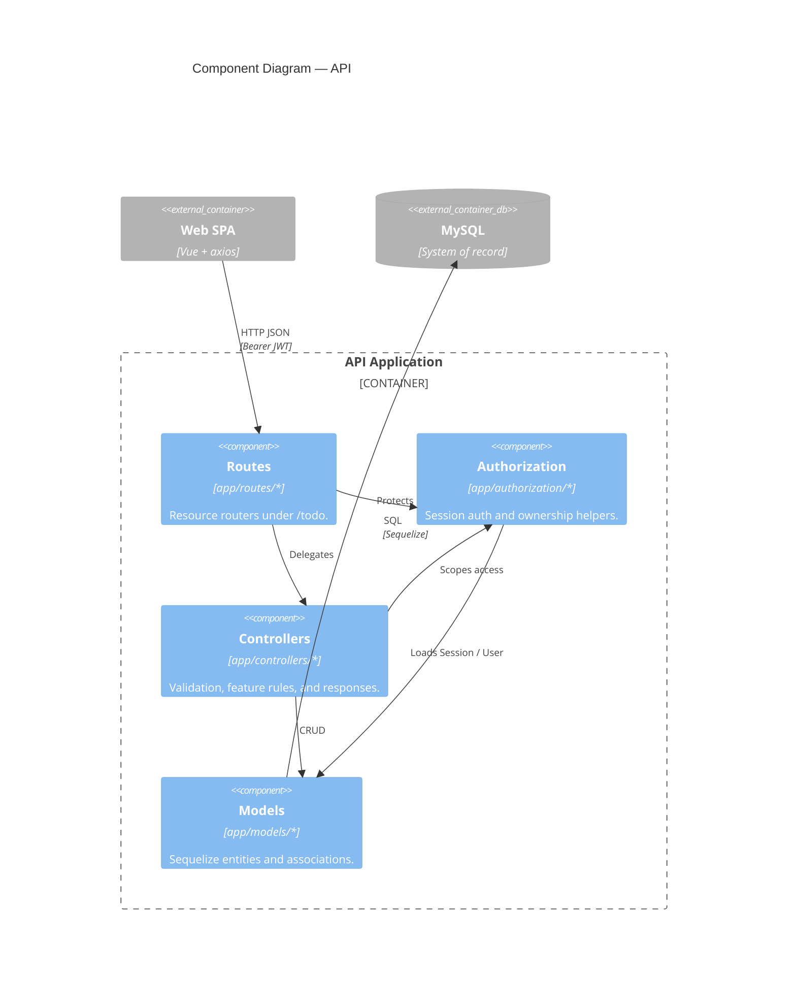

# C4 Level 3 — Backend components

Express app inside `backend/`, ordered along the HTTP handling path.

## Notes

- Protected routes authenticate first; controllers reuse authorization helpers for ownership checks.
- Cross-user resources return `404`, while missing or invalid sessions return `401`.
- Database/auth configuration and Winston logging are omitted to keep the request path readable; they remain under `app/config/`.

**Related:** [ADR-0002](../adr/0002-security-architecture.md) · [auth-patterns.mdc](../../.cursor/rules/auth-patterns.mdc) · [security.mdc](../../.cursor/rules/security.mdc)
