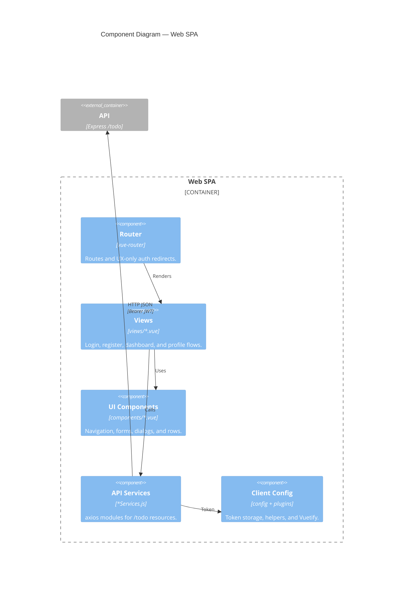

# C4 Level 3 — Frontend components

Vue SPA inside `frontend/src/`, ordered along the user interaction and API request path.

## Notes

- Router guards and `localStorage` improve UX only; the API remains authoritative.
- Views may compose UI components that call services for dialog actions; the main request spine is simplified above.
- API modules follow the `*Services.js` naming rule.

**Related:** [frontend-services.mdc](../../.cursor/rules/frontend-services.mdc) · [ui-style-system.mdc](../../.cursor/rules/ui-style-system.mdc)
