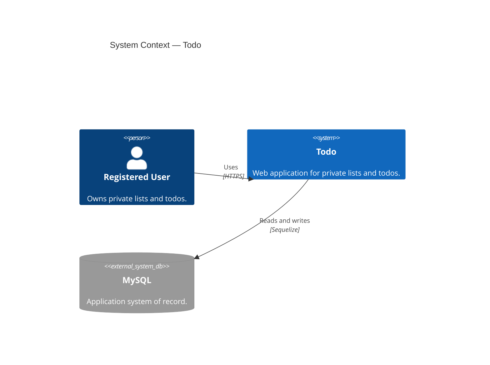

# C4 Level 1 — System context

**Todo** (the OC CS Speckit example application) stores each registered user's private lists and todos in MySQL through a server API. There are no external SaaS dependencies.

## Notes

- The Todo system contains the Vue SPA and Express API; the [container diagram](./c4-container.md) expands that boundary.
- The API is the source of truth. Browser storage is only a session/UX hint.

**Related:** [ADR-0001](../adr/0001-client-server-multi-user-architecture.md) · [ADR-0003](../adr/0003-mysql-relational-database.md)
