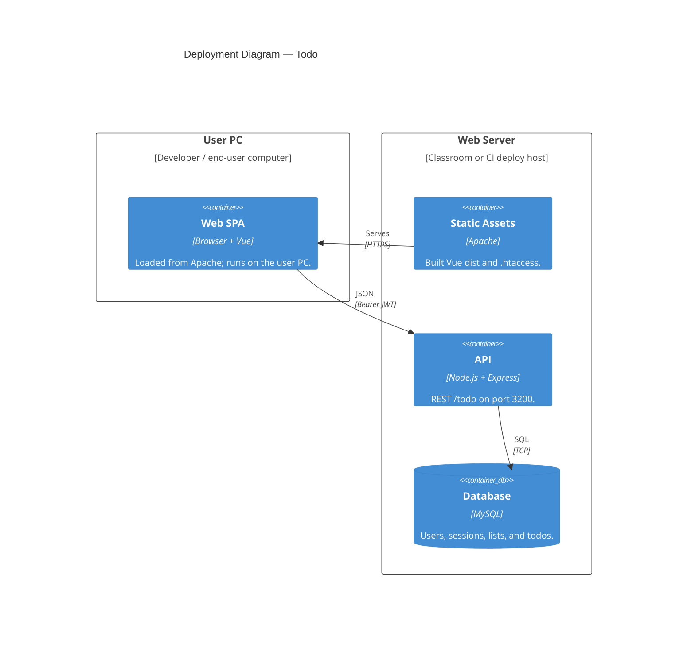

# C4 Level 4 — Deployment

Logical deployment: the **User PC** runs the SPA in a browser; the **Web Server** hosts static assets, the Node API, and MySQL.

## Typical ports

| Location | Service | Port |
|----------|---------|------|
| User PC | Browser | — |
| Web Server | Apache (SPA) | `80` / `443` |
| Web Server | Backend API | `3200` (or reverse-proxied) |
| Web Server | MySQL | `3306` |

## Notes

- Nested browser/Apache/runtime/database deployment nodes are intentionally flattened because Mermaid C4 packs deep nesting poorly in PDFs.
- **Local XAMPP classroom:** User PC and Web Server may be the **same** physical machine; the diagram preserves the logical browser/server boundary.
- **CI deploy** (`.github/workflows/deploy.yml`): builds SPA + backend, SSH-deploys static files and Node app to the Web Server; DB credentials via secrets.

**Related:** [ADR-0001](../adr/0001-client-server-multi-user-architecture.md) · [c4-container.md](./c4-container.md) · `.github/workflows/deploy.yml`
