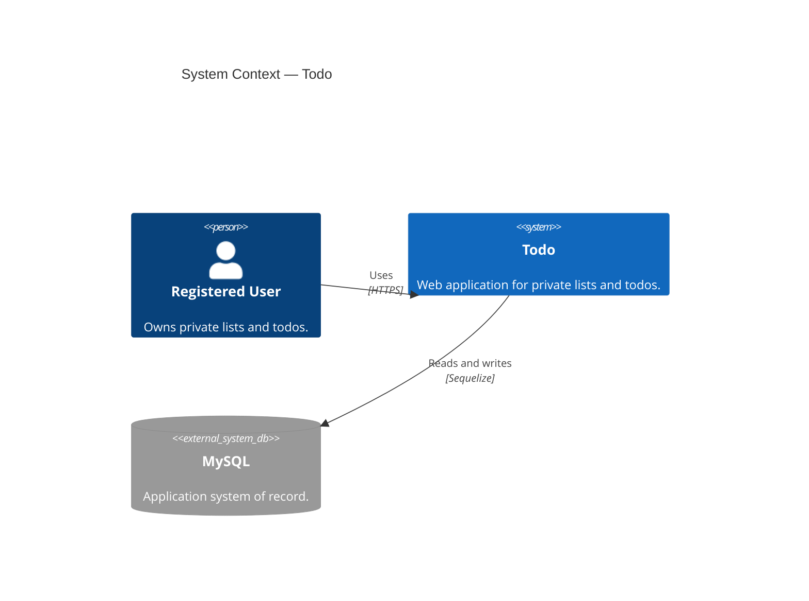
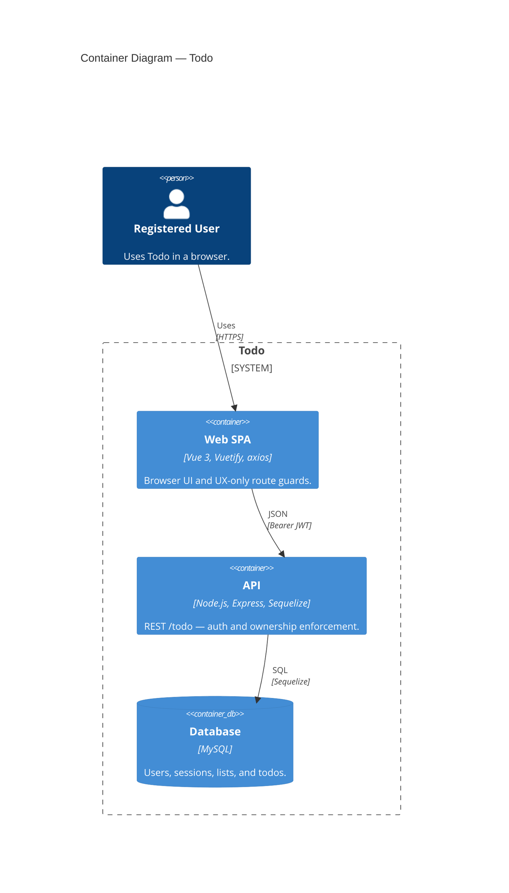
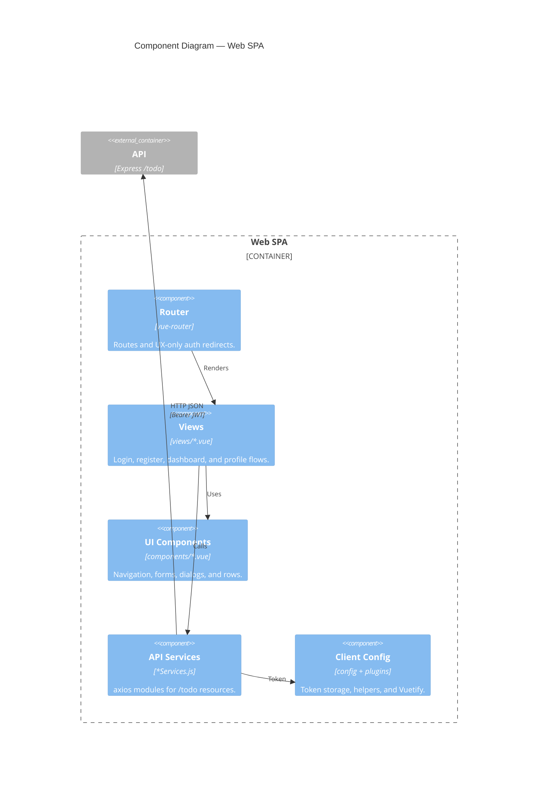
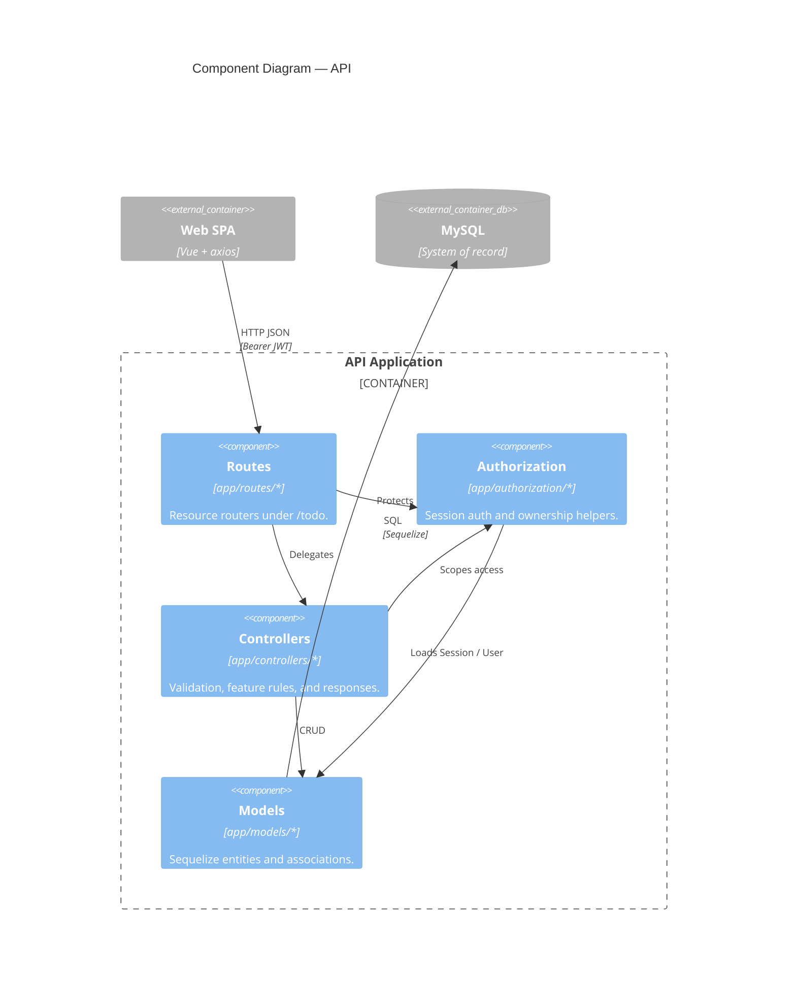
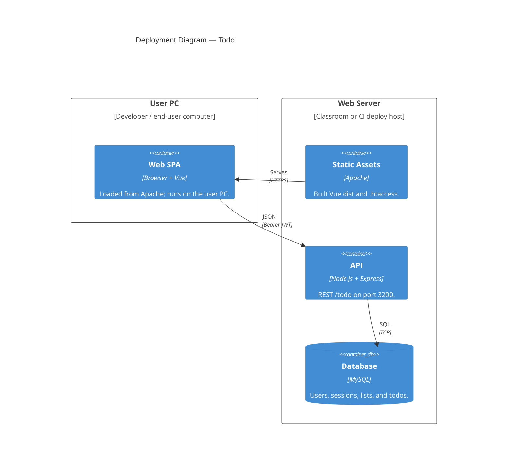

# Todo — Application Specifications

Product specs only: architecture decisions, quality attributes, C4 diagrams, and feature specifications (including UI mockups when linked under `docs/ui/`).

Excluded from this PDF: Cursor rules, SDD writing guides, `framework.md`, and living reference.
For the full methodology pack (rules + guides + reference), run `npm run specs:pdf`.

Mermaid C4 diagrams are rendered via `md-mermaid-pdf`.

---

# Part 1: Architecture Decision Records

<!-- source: docs/adr/README.md -->

# README.md

# Architecture Decision Records (ADRs)

Durable **why** decisions for cross-cutting concerns that outlive any single feature spec.

| Artifact | Question |
|----------|----------|
| [Constitution](../../.cursor/rules/constitution.mdc) | What are the non-negotiable laws? |
| [Cursor rules](../../.cursor/rules/) | How must we implement (patterns)? |
| **ADRs** (`docs/adr/`) | Why did we choose this approach? |
| [Feature specs](../../features/) | What must the product do? |
| [Quality attributes](../nfr/README.md) | What app-wide NFR / ility bars apply? |
| [Reference](../../features/reference/) | What exists on `dev` now? |

ADRs do **not** replace feature specs or Cursor rules. They capture context, alternatives, and consequences when a choice affects multiple features or the whole stack.

**Student guide:** [writing-adrs.md](./writing-adrs.md) ([PDF](./writing-adrs.pdf)) — when to write an ADR, naming, section principles, and checklist.

---

## When to write an ADR

| Situation | Write an ADR? |
|-----------|---------------|
| New product behavior for one feature | No — use `features/feature-N-*.md` |
| Ongoing coding pattern for the team | No — use `.cursor/rules/*.mdc` |
| Significant stack or architecture choice | **Yes** |
| Security or data-isolation model | **Yes** |
| Deviation from an existing rule | **Yes** — then update the rule |

Write the ADR **before** or **with** the first feature that depends on the decision. Link it from affected feature specs (`**Related:**` in the header).

---

## File naming

```
docs/adr/
  README.md                 ← this file
  writing-adrs.md           ← student guide (when / how to write)
  NNNN-short-kebab-title.md ← one decision per file
```

- **Number:** four digits, sequential (`0001`, `0002`, …). Never reuse a retired number.
- **Title:** short, specific, kebab-case.
- **Status:** `Proposed` | `Accepted` | `Deprecated` | `Superseded by ADR-NNNN`

---

## Template

Copy the block below into a new file and fill in each section.

```markdown
# ADR-NNNN: Short title

**Status:** Proposed | Accepted | Deprecated | Superseded by [ADR-XXXX](XXXX-title.md)
**Date:** YYYY-MM-DD
**Deciders:** team / role names

## Context

What problem or constraint forced a decision? What was unclear?

## Decision

What we chose, in one or two sentences. Be specific (technologies, boundaries, invariants).

## Consequences

### Positive
- …

### Negative / tradeoffs
- …

## Alternatives considered

| Option | Why not |
|--------|---------|
| … | … |

## Related artifacts

- Feature specs: …
- Cursor rules: …
- Supersedes / superseded by: …
```

---

## Index

| ADR | Title | Status |
|-----|-------|--------|
| [0001](./0001-client-server-multi-user-architecture.md) | Client–server architecture for multi-user todo data | Accepted |
| [0002](./0002-security-architecture.md) | Layered security architecture | Accepted |
| [0003](./0003-mysql-relational-database.md) | MySQL relational database | Accepted |
| [0004](./0004-vue-frontend-framework.md) | Vue 3 as the frontend framework | Accepted |
| [0005](./0005-vuetify-ui-library.md) | Vuetify 4 as the UI component library | Accepted |
| [0006](./0006-node-express-api.md) | Node.js and Express as the API runtime | Accepted |
| [0007](./0007-rest-json-api.md) | REST and flat JSON as the API style | Accepted |
| [0008](./0008-sequelize-orm.md) | Sequelize as the Node ORM | Accepted |

<div style="page-break-after: always;"></div>

<!-- source: docs/adr/0001-client-server-multi-user-architecture.md -->

# 0001-client-server-multi-user-architecture.md

# ADR-0001: Client–server architecture for multi-user todo data

**Status:** Accepted  
**Date:** 2026-07-07  
**Deciders:** OC CS Speckit project (SDD kit; Todo example application)

## Context

The **Todo** example application shipped with OC CS Speckit is a **multi-user** todo app: each registered user owns private lists and items. No user may read or modify another user's data. The kit must be teachable as a Spec-Driven Development reference — clear boundaries between specification, frontend, backend, and tests.

We needed to decide:

1. Whether the browser holds authoritative state or only talks to a shared server.
2. How to identify the caller on every API request.
3. How to enforce per-user data isolation consistently across features.

A single-user or offline-first design (localStorage as source of truth, optional sync) would simplify the SPA but would not model real multi-tenant boundaries or shared MySQL persistence.

## Decision

Adopt a **classic client–server split** with a **stateless REST API** and **server-enforced user scoping**:

| Layer | Choice |
|-------|--------|
| **Client** | Vue 3 SPA (Vite), Vuetify 4, axios |
| **Server** | Node.js + Express + Sequelize (ES modules) |
| **Database** | MySQL — single shared database, rows scoped by `userId` |
| **Transport** | JSON over HTTPS; API base path `/todo/` |
| **Auth** | Username + password; bcrypt hashes; **JWT + Session table** (token stored server-side, revocable on logout) |
| **Client session hint** | Login response stored in `localStorage` key `user`; axios attaches `Authorization: Bearer <token>` on every request |
| **Authorization** | `authenticate` middleware sets `req.user.id`; all list/todo queries filter by `userId`; create writes use `req.user.id`, never body; cross-user access returns **404** (not 403) |
| **Repo layout** | Monorepo: `frontend/` + `backend/` + `features/` specs |

```text
Browser (Vue SPA)                    Express API                 MySQL
─────────────────                    ───────────                 ─────
localStorage["user"]  ──Bearer──►   authenticate middleware  ──► sessions, users
router guards (UI)                   controllers + auth helpers    lists, todos
                                     userId in every WHERE clause
```

**Invariants** (must hold in every feature):

1. The server is the **source of truth** for lists, todos, and profile data.
2. Every authenticated request resolves to **exactly one** `req.user.id` from a valid session row.
3. **No endpoint** returns or mutates rows owned by another user.
4. The client never sends a trusted `userId` on create — the server assigns ownership.

## Consequences

### Positive

- Clear SDD layers: feature specs → API contract → implementation → Jest/Vitest proof.
- Realistic multi-user security model suitable for classroom and production-style review.
- Session revocation on logout (empty token on Session row) — not possible with JWT-only, client-only auth.
- Same patterns extend to Features 2–5 without re-deciding architecture.

### Negative / tradeoffs

- Requires a running MySQL instance and backend for full-stack work (not a static or offline demo).
- `localStorage` session is a **convenience cache** for UX (router guards, display name); it is not authoritative — 401 clears it and redirects to login.
- Per-user row scoping in SQL is simpler than org/team tenancy; multi-org would need a new ADR and schema work.
- CORS and two dev ports (`8082` frontend, `3200` backend) add local setup steps.

## Alternatives considered

| Option | Why not |
|--------|---------|
| **localStorage-only todos (no backend)** | No shared database, no real multi-user isolation, does not match course API/testing goals. |
| **JWT in cookie only, no Session table** | Harder to revoke on logout; server cannot invalidate a stolen token without extra infrastructure. |
| **GraphQL or tRPC** | Heavier stack; REST + flat JSON matches existing rules and Agility export simplicity. |
| **403 Forbidden on cross-user IDs** | Leaks that a resource exists; **404** treats other users' rows as not found (see `security.mdc`). |
| **Server-rendered Vue (SSR)** | Out of scope for Vite SPA starter; auth still needs the same session model. |

## Related artifacts

- ADRs: [ADR-0002 — Layered security architecture](./0002-security-architecture.md), [ADR-0003 — MySQL relational database](./0003-mysql-relational-database.md), [ADR-0004 — Vue 3 as the frontend framework](./0004-vue-frontend-framework.md), [ADR-0006 — Node.js and Express as the API runtime](./0006-node-express-api.md), [ADR-0007 — REST and flat JSON](./0007-rest-json-api.md)
- C4 diagrams: [docs/arch_diagrams/](../arch_diagrams/README.md) (context, container, component)
- Feature specs: [Feature 1 — User Authentication](../../features/feature-1-user-auth.md) (identity foundation); Features 2–3 (list/todo isolation)
- Cursor rules: [auth-patterns.mdc](../../.cursor/rules/auth-patterns.mdc), [security.mdc](../../.cursor/rules/security.mdc), [frontend-services.mdc](../../.cursor/rules/frontend-services.mdc), [project-structure.mdc](../../.cursor/rules/project-structure.mdc)
- Reference: [api.md](../../features/reference/api.md), [data-model.md](../../features/reference/data-model.md)

<div style="page-break-after: always;"></div>

<!-- source: docs/adr/0002-security-architecture.md -->

# 0002-security-architecture.md

# ADR-0002: Layered security architecture

**Status:** Accepted  
**Date:** 2026-07-07  
**Deciders:** OC CS Speckit project (SDD kit; Todo example application)

## Context

[ADR-0001](./0001-client-server-multi-user-architecture.md) establishes the client–server split and per-user data boundaries. Security still needed an explicit model for **where** trust is enforced, **how** sessions are validated, and **what** the application deliberately does not implement in v1.

Threats relevant to this app:

- User A accessing user B's lists, todos, or profile.
- Stolen or replayed session tokens after logout or expiry.
- Client tampering (`userId` in request body, ID enumeration).
- Credential disclosure (password hashes in API responses, weak storage).
- Relying on frontend-only checks (router guards, form validation) as security controls.

The security model must be teachable, testable via Gherkin scenarios, and consistent across Features 1–5 without re-deciding per endpoint.

## Decision

Adopt a **layered security architecture** with the **API as the sole enforcement point** and **defense in depth** on the client for UX only.

### Trust boundaries

```text
┌─────────────────────────────────────────────────────────────┐
│  Browser (untrusted)                                        │
│  • localStorage session hint                                │
│  • Router guards + Vuetify validation (UX only)             │
└──────────────────────────┬──────────────────────────────────┘
                           │ HTTPS + Authorization: Bearer
                           ▼
┌─────────────────────────────────────────────────────────────┐
│  Express API (trusted enforcement)                          │
│  1. authenticate middleware → req.user.id                   │
│  2. Controller validation → 400 on bad input                │
│  3. Authorization helpers → scope every read/write          │
│  4. Never return password hashes                            │
└──────────────────────────┬──────────────────────────────────┘
                           │ Parameterized Sequelize queries
                           ▼
┌─────────────────────────────────────────────────────────────┐
│  MySQL (persistence)                                        │
│  • userId FK on lists/todos                                 │
│  • sessions table for revocable tokens                      │
└─────────────────────────────────────────────────────────────┘
```

### Layer 1 — Authentication (who is calling?)

| Control | Implementation |
|---------|----------------|
| Credentials | Username + password; username normalized `trim().toLowerCase()` |
| Password storage | bcryptjs, `SALT_ROUNDS = 10`; minimum 8 characters at registration/update |
| Session token | JWT signed with `AUTH_SECRET`; **also** stored in `sessions` table with `expirationDate` |
| Token lifetime | 24 hours |
| Request proof | `Authorization: Bearer <token>` on every protected route |
| Validation | `authenticate` middleware: token must exist in DB, not expired, joined to a user |
| Logout | Clear token on session row (server-side revocation) |
| Identity on request | `req.user = { id, role }` — controllers use `req.user.id` only |

**Hybrid JWT + Session table:** the JWT carries the token value; the database row is the revocation and expiry gate. Logout and expiry are enforceable without a token blacklist service.

### Layer 2 — Authorization (what may this user do?)

| Control | Implementation |
|---------|----------------|
| Row-level scope | Every list/todo query includes `userId: req.user.id` in the `WHERE` clause |
| Create ownership | Set `userId` from `req.user.id`; **ignore** client-supplied `userId` in body |
| Update/delete | Load via `getAccessibleListOrNull`, `getAccessibleTodoOrNull`, or `getAccessibleUserOrNull` |
| Cross-user access | Return **404** with a not-found message — never **403** (avoids confirming resource existence) |
| Profile access | User may only `GET`/`PUT` their own `userId`; `:id` must match `req.user.id` |
| Centralization | All scope checks live in `backend/app/authorization/` — controllers do not inline duplicate logic |

### Layer 3 — Client hardening (UX, not security)

| Control | Purpose |
|---------|---------|
| `router.beforeEach` | Redirect unauthenticated users away from protected routes |
| axios `transformRequest` | Attach Bearer token from `localStorage` |
| axios `transformResponse` | On 401, clear `user` and redirect to login |
| Vuetify form rules | Block invalid submits before network (email format, password length, required fields) |

**Rule:** passing a Vitest router test or skipping client validation must **not** grant access; Jest + supertest against the API is the security proof.

### Layer 4 — Secrets and configuration

| Secret / config | Location |
|---------------|----------|
| `AUTH_SECRET` | `backend/.env` — never committed |
| DB credentials | `backend/.env` / `backend/.env.test` |
| Password reset endpoint | Disabled when `NODE_ENV === "production"` |

### Roles (foundation only)

New users receive role `worker`. Middleware hooks (`requireAdmin`, `requireSuperAdmin`) exist for future admin features but are not used by current todo CRUD. Todo data is scoped by **user**, not role.

### Explicitly out of scope (v1)

Documented deferrals — not security holes by omission in the teaching model, but not implemented:

| Control | Status |
|---------|--------|
| Rate limiting / brute-force lockout | Out of scope |
| CSRF tokens | Not required for Bearer-header SPA API (no cookie session) |
| OAuth / social login | Out of scope (Feature 1) |
| Email verification / password reset flow | Out of scope |
| Field-level encryption at rest | Out of scope |
| Multi-org / tenant isolation | Future ADR if added |
| Content Security Policy / Helmet hardening | Recommended for production deploy; not spec-gated |

## Consequences

### Positive

- Single enforcement point (`authenticate` + authorization helpers) — easy to audit and test.
- Gherkin scenarios in Features 1–4 map directly to security behavior (401, 404, ownership).
- Revocable sessions without Redis or a dedicated token blacklist.
- 404-on-cross-user pattern reduces information leakage in a shared-database multi-user app.
- Centralized helpers prevent scope-check drift across controllers.

### Negative / tradeoffs

- Bearer token in `localStorage` is vulnerable to XSS — mitigated by framework defaults and no `v-html` on user content, but not as strong as HttpOnly cookies.
- No rate limiting leaves login open to online brute force in a public deployment.
- Per-user scoping does not scale to shared lists or teams without schema and ADR changes.
- Client and server both validate inputs — duplicate logic maintained deliberately (UX vs enforcement).

## Alternatives considered

| Option | Why not |
|--------|---------|
| **Frontend-only auth (router guard sufficient)** | Trivially bypassed via curl; fails constitution Principle 3. |
| **403 on cross-user ID** | Confirms resource exists to an attacker probing IDs. |
| **Trust `userId` from request body on create** | Client can assign rows to other users. |
| **JWT only (no Session table)** | Cannot revoke on logout without extra infrastructure. |
| **Cookie-based session without Bearer** | Complicates SPA CORS/dev setup; CSRF becomes mandatory. |
| **Inline scope checks per controller** | Duplication risk; already rejected in favor of `getAccessible*OrNull` helpers. |
| **RBAC for todo ownership** | Overkill; `worker` role + `userId` FK is sufficient for private todos. |

## Related artifacts

- ADRs: [ADR-0001 — Client–server multi-user architecture](./0001-client-server-multi-user-architecture.md), [ADR-0006 — Node.js and Express](./0006-node-express-api.md)
- Feature specs: [Feature 1](../../features/feature-1-user-auth.md) (auth); [Features 2–3](../../features/feature-2-todo-list-management.md) (list/todo isolation); [Feature 4](../../features/feature-4-user-profile-management.md) (profile scope)
- Cursor rules: [security.mdc](../../.cursor/rules/security.mdc), [auth-patterns.mdc](../../.cursor/rules/auth-patterns.mdc), [frontend-services.mdc](../../.cursor/rules/frontend-services.mdc)
- Implementation: `backend/app/authorization/authorization.js`
- Tests: `backend/tests/authenticate.test.js`, `backend/tests/auth.test.js`, ownership scenarios in `lists.test.js`, `todos.test.js`, `users.test.js`

<div style="page-break-after: always;"></div>

<!-- source: docs/adr/0003-mysql-relational-database.md -->

# 0003-mysql-relational-database.md

# ADR-0003: MySQL relational database

**Status:** Accepted  
**Date:** 2026-07-07  
**Deciders:** OC CS Speckit project (SDD kit; Todo example application)

## Context

The **Todo** example application persists multi-user identity, sessions, lists, and todos. The data is inherently **relational**: users own lists; lists contain todos; sessions belong to users. [ADR-0001](./0001-client-server-multi-user-architecture.md) requires a shared server-side database; [ADR-0002](./0002-security-architecture.md) requires row-level ownership enforced in every query.

We needed to decide:

1. **Relational SQL vs document/NoSQL** for this domain.
2. **Which SQL engine** fits a classroom + XAMPP-style local setup.
3. **How** the Node backend talks to the database (ORM, schema evolution, tests).

The stack must work on developer laptops (often XAMPP with MySQL already installed), support foreign keys and transactions, and stay simple enough to teach alongside Sequelize models and Jest integration tests.

## Decision

Use **MySQL** as the production database with **Sequelize 6** as the ORM ([ADR-0008](./0008-sequelize-orm.md)) and **relational, normalized tables** scoped by `userId` foreign keys.

### Stack

| Layer | Choice |
|-------|--------|
| **Database** | MySQL 5.7+ / 8.x (via XAMPP, Docker, or native install) |
| **Driver** | `mysql2` |
| **ORM** | Sequelize 6 (ES modules) |
| **Config** | `backend/app/config/db.config.js` + `sequelizeInstance.js`; credentials from `.env` |
| **Default database** | `todospeckit-db` |
| **Test database** | Separate `todospeckit-db-test` (`backend/.env.test`) |

### Schema model

Four core tables with explicit foreign keys (see [data-model.md](../../features/reference/data-model.md)):

```text
users ──┬── sessions
        ├── lists ── todos
        └── todos (direct userId for authorization queries)
```

| Table | Purpose |
|-------|---------|
| `users` | Accounts; bcrypt password hash; unique `email` and `username` |
| `sessions` | Revocable Bearer tokens; `expirationDate`; FK → `users.id` |
| `lists` | Per-user todo lists; FK → `users.id` |
| `todos` | Items in a list; FK → `lists.id` + `users.id`; `onDelete: CASCADE` from list |

**Design rules:**

- **Normalized relational schema** — no embedded todo arrays in list documents.
- **`userId` on lists and todos** — enables authorization `WHERE` clauses without joins-only assumptions.
- **Cascade delete** — removing a list deletes its todos (US-3.6).
- **`DATEONLY` for `dueDate`** — date-only semantics without timezone complexity (Feature 5).
- **Timestamps** — Sequelize `createdAt` / `updatedAt` on all tables.
- **Uniqueness** — email and username enforced at DB + controller.

### Schema evolution

| Environment | Strategy |
|-------------|----------|
| **Development** | `sequelize.sync({ alter: true })` on server start when `SEQUELIZE_SYNC_ALTER=true` (default in `.env.example`) |
| **Production** | `sync()` without alter; schema changes require explicit migration discipline (out of scope for v1 teaching model) |
| **Tests** | `sync({ force: true })` in Jest `beforeAll` — drops and recreates tables per suite; `resetTestDatabase()` truncates between tests |

No checked-in Sequelize migration files in v1 — schema is defined in `backend/app/models/*.model.js` and synced. Feature specs authorize schema changes; `features/reference/data-model.md` is updated in the same feature PR when schema changes (see [Agent implementation request](../../features/framework.md#agent-implementation-request)).

### Connection handling

- Connection pool: `max: 5`, `min: 0` in `db.config.js`.
- Server refuses to start if sync fails outside `NODE_ENV=test`.
- Tests close `db.sequelize` in `afterAll` to avoid connection leaks across suites.

### Query patterns

- Sequelize model definitions + `findOne` / `findAll` with explicit `where` clauses.
- Authorization helpers add `userId: req.user.id` to every scoped lookup.
- `User.unscoped()` only when bcrypt password comparison requires the hash column.

## Consequences

### Positive

- Natural fit for user → list → todo hierarchy and FK integrity.
- MySQL ships with XAMPP — low friction for local full-stack development.
- Sequelize models map cleanly to SDD **Data Model Requirements** sections in feature specs.
- Separate test database prevents dev data loss during `force: true` test sync.
- `alter: true` in dev speeds iteration without hand-written migrations for coursework.
- SQL `WHERE userId = ?` aligns with [ADR-0002](./0002-security-architecture.md) authorization model.

### Negative / tradeoffs

- MySQL must be installed and running — not zero-dependency like SQLite file DB.
- `sync({ alter: true })` is unsafe for production schema changes; real deployments need migrations (deferred).
- Sequelize adds abstraction weight vs raw SQL.
- No read replicas, sharding, or connection pooling beyond defaults — single-instance assumption.
- `DATEONLY` avoids timezones but does not support time-of-day due dates (Feature 5 out of scope).

## Alternatives considered

| Option | Why not |
|--------|---------|
| **SQLite (file DB)** | Simpler setup but weaker classroom alignment with deployed MySQL; concurrent test + dev access is awkward. |
| **PostgreSQL** | Excellent choice for production; less universal in XAMPP/LAMP developer environments for this course. |
| **MongoDB / document store** | Todo-in-list fits poorly without duplicating ownership; cross-user isolation harder to reason about in specs. |
| **JSON files / in-memory store** | No real multi-user persistence; fails ADR-0001. |
| **Prisma** | Viable ORM; rejected for Speckit in [ADR-0008](./0008-sequelize-orm.md) — Sequelize is the course standard. |
| **Raw SQL only (no ORM)** | More boilerplate; see ADR-0008. |
| **Single shared DB for dev and test** | Risk of wiping developer data when tests run `force: true`. |

## Related artifacts

- ADRs: [ADR-0001](./0001-client-server-multi-user-architecture.md), [ADR-0002](./0002-security-architecture.md), [ADR-0006](./0006-node-express-api.md), [ADR-0008](./0008-sequelize-orm.md)
- Reference: [data-model.md](../../features/reference/data-model.md)
- Cursor rules: [api-conventions.mdc](../../.cursor/rules/api-conventions.mdc), [project-structure.mdc](../../.cursor/rules/project-structure.mdc)
- Config: `backend/app/config/db.config.js`, `backend/.env.example`, `backend/.env.test.example`
- Models: `backend/app/models/`
- Tests: `backend/tests/helpers.js` (`syncTestDatabase`, `resetTestDatabase`)

<div style="page-break-after: always;"></div>

<!-- source: docs/adr/0004-vue-frontend-framework.md -->

# 0004-vue-frontend-framework.md

# ADR-0004: Vue 3 as the frontend framework

**Status:** Accepted  
**Date:** 2026-08-26  
**Deciders:** OC CS Speckit project (SDD kit; Todo example application)

## Context

[ADR-0001](./0001-client-server-multi-user-architecture.md) establishes a **client–server** Todo example: a browser SPA talks to an Express REST API. We still needed an explicit choice of **SPA framework** for Speckit’s frontend shell (starter kit and Todo answer key).

Constraints for the kit:

1. **Teachable SDD** — students and Cursor agents must map Screen Requirements to a small, consistent set of files (`views/`, `components/`, `services/`).
2. **Course-aligned stack** — OC CS materials and prior Vue coursework should transfer; avoid introducing a second major UI paradigm.
3. **Component UI library** — Speckit standardizes on **Vuetify 4** ([ADR-0005](./0005-vuetify-ui-library.md); see `ui-style-system.mdc`); the framework must integrate cleanly with that library.
4. **SPA + Vite** — client-side routing, axios services, and Vitest + `@vue/test-utils` for Gherkin-backed UI tests.
5. **Agent-friendly** — clear Options/Composition API patterns and a stable directory layout encoded in Cursor rules.

Choosing React, Svelte, or Angular would force a different component library, test stack, and rewrite of frontend rules — without improving the SDD teaching goals.

## Decision

Adopt **Vue 3** (with **Vite**) as the SPA framework for OC CS Speckit:

| Concern | Choice |
|---------|--------|
| **Framework** | Vue 3 (ES modules) |
| **Build / dev** | Vite (dev port **8082**) |
| **UI kit** | Vuetify 4 |
| **Routing** | `vue-router` with `beforeEach` guards for auth UX |
| **HTTP** | axios via `frontend/src/services/` (`*Services.js`) — no axios in views |
| **Tests** | Vitest + `@vue/test-utils` |
| **Layout** | `frontend/src/views/`, `components/`, `services/`, `plugins/` (see `project-structure.mdc`) |

```text
features/ Screen Requirements
        │
        ▼
frontend/src/views/*.vue  ←── services/*Services.js  ←── axios ──► Express /todo/
        │
        └── components/ + Vuetify 4 (ui-style-system.mdc)
```

**Invariants:**

1. Product UI lives under `frontend/` as a Vue SPA — not server-rendered HTML as the primary UI.
2. Views call **services**, not raw axios (constitution / `frontend-services.mdc`).
3. Stack deviations (e.g. React, Tailwind as primary system) require a new ADR and rule updates — not ad-hoc feature code.

## Consequences

### Positive

- Aligns with OC CS Vue teaching path and existing Speckit Cursor rules (`ui-style-system`, `frontend-services`).
- Vuetify 4 is first-class for Vue 3; Screen Requirements can name Vuetify patterns without inventing a design system.
- Vite keeps local DX simple (fast HMR, clear env split for API base URL).
- Vitest + Vue Test Utils match Gherkin scenarios for Login, Dashboard, etc.
- Starter-kit overlay can ship a thin Vue shell (`App.vue`, `Home.vue`, router) that features extend incrementally.

### Negative / tradeoffs

- Students who only know React must learn Vue idioms (or reverse for other courses).
- Vue ecosystem choices (Composition vs Options API, pinia vs local state) still need course guidance — Speckit prefers patterns already in rules/specs, not every Vue plugin.
- SSR / Nuxt is out of scope; SEO and first-paint for a public marketing site are not goals of this kit.

## Alternatives considered

| Option | Why not |
|--------|---------|
| **React + Vite** | Strong ecosystem, but breaks Vuetify-first UI rules and OC CS Vue continuity; would require rewriting frontend rules and starter shell. |
| **Angular** | Heavier framework and tooling for a small Todo/SPA teaching kit; steeper curve for feature-by-feature SDD slices. |
| **Svelte / Solid** | Excellent DX, but weaker match to course materials and Vuetify; fewer shared patterns in OC CS Speckit docs. |
| **Plain JS / jQuery SPA** | Insufficient structure for services layer, router guards, and Vitest component tests tied to Gherkin. |
| **Nuxt / Vue SSR** | Extra deployment and auth complexity; ADR-0001 targets a Vite SPA talking to Express. |

## Related artifacts

- ADRs: [ADR-0001 — Client–server multi-user architecture](./0001-client-server-multi-user-architecture.md), [ADR-0005 — Vuetify 4 as the UI component library](./0005-vuetify-ui-library.md)
- Cursor rules: [project-structure.mdc](../../.cursor/rules/project-structure.mdc), [frontend-services.mdc](../../.cursor/rules/frontend-services.mdc), [ui-style-system.mdc](../../.cursor/rules/ui-style-system.mdc), [constitution.mdc](../../.cursor/rules/constitution.mdc) (Principle 5 — stack consistency)
- Features: [Feature 1 — User Authentication](../../features/feature-1-user-auth.md) (first Vue screens); Features 2–5 (Dashboard, profile, due dates)
- C4: [docs/arch_diagrams/](../arch_diagrams/README.md) (frontend container / components)
- Starter kit: [docs/STARTER-KIT.md](../STARTER-KIT.md) (empty Vue shell in overlay)

<div style="page-break-after: always;"></div>

<!-- source: docs/adr/0005-vuetify-ui-library.md -->

# 0005-vuetify-ui-library.md

# ADR-0005: Vuetify 4 as the UI component library

**Status:** Accepted  
**Date:** 2026-08-26  
**Deciders:** OC CS Speckit project (SDD kit; Todo example application)

## Context

[ADR-0004](./0004-vue-frontend-framework.md) selects **Vue 3 + Vite** for the Speckit SPA. Feature Screen Requirements still need a **single component and theming system** so students and Cursor agents do not invent ad-hoc CSS, Tailwind utilities, or mixed UI kits per feature.

Constraints:

1. **One design system** — Screen Requirements can name layouts, dialogs, forms, and buttons in a shared vocabulary.
2. **Vue 3 native** — Material-style components that integrate with Vite and `<script setup>`.
3. **Academic brand** — OC maroon / academic tokens live in one place (`plugins/vuetify.js`); views use theme names, not scattered hex.
4. **Agent guardrails** — Cursor rules must be able to say “Vuetify only” without debating CSS frameworks every prompt.
5. **Teachable forms & dialogs** — Login, Register, Dashboard list/todo CRUD, and profile flows need dialogs, text fields, and navigation chrome out of the box.

Without a fixed UI library, Feature 1–5 specs would either over-specify CSS or accept inconsistent UIs that fail visual and testing conventions.

## Decision

Adopt **Vuetify 4** as the **only** primary UI component library for OC CS Speckit frontends:

| Concern | Choice |
|---------|--------|
| **Library** | Vuetify 4 |
| **Plugin** | `vite-plugin-vuetify` (`autoImport: false` — explicit imports as required by course rules) |
| **Icons** | `@mdi/font` |
| **Theme** | Light theme tokens in `frontend/src/plugins/vuetify.js` (OC Academic Edition — primary maroon `#801328`, Inter font) |
| **Encoding** | [ui-style-system.mdc](../../.cursor/rules/ui-style-system.mdc) — Vuetify only; **no Tailwind** as the design system |
| **API style** | Vue 3 `<script setup>` exclusively |

```text
Screen Requirements (features/)
        │
        ▼
views / components  ──►  Vuetify 4 components (v-btn, v-dialog, v-text-field, …)
        │
        └── theme colors / typography from plugins/vuetify.js
```

**Invariants:**

1. Product UI uses Vuetify components and theme tokens — not Tailwind utility classes as the primary styling approach.
2. Brand hex values live **only** in `plugins/vuetify.js`; views use Vuetify color names / CSS variables.
3. Replacing Vuetify (or adding a second competing UI kit) requires a new ADR and updates to `ui-style-system.mdc`.

## Consequences

### Positive

- Screen Requirements can reference familiar Vuetify patterns (forms, `v-dialog`, app bars) without inventing a custom kit.
- One theme file keeps OC Academic branding consistent across Login, Dashboard, and MenuBar.
- Cursor agents get a hard “Vuetify only / no Tailwind” rule, reducing stack thrash.
- Matches Vue 3 + Vite choice (ADR-0004) and existing starter-kit / Todo shells.

### Negative / tradeoffs

- Bundle size and Material look are heavier than a minimal custom CSS approach.
- Students must learn Vuetify APIs (props, density, slots) in addition to Vue.
- Strict “no Tailwind” means utility-first habits from other courses do not transfer; occasional scoped CSS is fine for layout tweaks, not a second design system.
- Vuetify major upgrades (3 → 4 already taken) can require coordinated rule and view updates.

## Alternatives considered

| Option | Why not |
|--------|---------|
| **Tailwind CSS (+ Headless UI)** | Flexible, but no single component contract for Screen Requirements; conflicts with Speckit’s “no Tailwind” academic edition rule and invites one-off styling. |
| **PrimeVue / Quasar** | Capable Vue libraries, but not the OC Speckit / course standard; would fork docs and agent rules. |
| **Naive UI / Element Plus** | Strong Vue 3 kits; same problem — second ecosystem without course alignment. |
| **Custom CSS / BEM only** | Too slow for feature-by-feature SDD; agents and students reinvent dialogs/forms inconsistently. |
| **Bootstrap Vue** | Aging fit for Vue 3 + Vite teaching path; weaker Material/academic token story for this kit. |

## Related artifacts

- ADRs: [ADR-0004 — Vue 3 as the frontend framework](./0004-vue-frontend-framework.md), [ADR-0001 — Client–server multi-user architecture](./0001-client-server-multi-user-architecture.md)
- Cursor rules: [ui-style-system.mdc](../../.cursor/rules/ui-style-system.mdc), [frontend-services.mdc](../../.cursor/rules/frontend-services.mdc), [constitution.mdc](../../.cursor/rules/constitution.mdc) (Principle 5)
- Implementation: `frontend/src/plugins/vuetify.js`, Feature 1–5 Screen Requirements
- Starter kit: [docs/STARTER-KIT.md](../STARTER-KIT.md) (Vuetify-enabled Vue shell)

<div style="page-break-after: always;"></div>

<!-- source: docs/adr/0006-node-express-api.md -->

# 0006-node-express-api.md

# ADR-0006: Node.js and Express as the API runtime

**Status:** Accepted  
**Date:** 2026-08-26  
**Deciders:** OC CS Speckit project (SDD kit; Todo example application)

## Context

[ADR-0001](./0001-client-server-multi-user-architecture.md) requires a **server-side REST API** as the source of truth for multi-user Todo data. [ADR-0003](./0003-mysql-relational-database.md) selects MySQL + Sequelize. We still needed an explicit choice of **runtime and HTTP framework** for Speckit’s `backend/` shell (starter kit and Todo answer key).

Constraints:

1. **Teachable SDD** — students and Cursor map API Requirements to a small layout: `routes/`, `controllers/`, `models/`, `authorization/`.
2. **Same language as tooling** — Node is already used for Vite, Jest, Vitest, and repo scripts (`starter:zip`, Agility, PDF export).
3. **REST + flat JSON** — matches `api-conventions.mdc` and feature Gherkin (supertest against Express `app`).
4. **Classroom deploy** — long-running Node process + static SPA is simpler than a heavy application server for this kit.
5. **ES modules** — `"type": "module"` throughout backend for consistency with modern Node and frontend tooling.

Choosing Java/Spring, .NET, Python/Django, or PHP as the *primary* Speckit API would fork the monorepo story, Cursor rules, and test harness without improving SDD pedagogy for this course stack.

## Decision

Adopt **Node.js** (current LTS suitable for the course, e.g. 24+) with **Express 4** as the HTTP framework for OC CS Speckit APIs:

| Concern | Choice |
|---------|--------|
| **Runtime** | Node.js (ES modules — `"type": "module"`) |
| **HTTP framework** | Express 4 |
| **API mount** | `/todo/` for the Todo example (starter kit may use `/api/` until renamed) |
| **Persistence** | Sequelize 6 + `mysql2` ([ADR-0003](./0003-mysql-relational-database.md)) |
| **Auth** | bcryptjs, JWT, Session table ([ADR-0002](./0002-security-architecture.md)) |
| **Logging** | winston + morgan |
| **Tests** | Jest + supertest against exported `app` |
| **Layout** | `backend/server.js`, `backend/app/{routes,controllers,models,authorization,config}/` |

```text
Vue SPA (ADR-0004)  ──JSON / Bearer──►  Express (this ADR)
                                              │
                                              ├── authenticate middleware
                                              ├── controllers + routes
                                              └── Sequelize ──► MySQL (ADR-0003)
```

**Invariants:**

1. The product API is a **Node + Express** service under `backend/` — not PHP pages or a second backend stack in the same kit.
2. Routes register through `app/routes/index.js`; `server.js` mounts the API prefix and syncs Sequelize on startup.
3. Replacing Node/Express (or adding a parallel primary API framework) requires a new ADR and updates to `api-conventions.mdc` / `project-structure.mdc`.

## Consequences

### Positive

- One language across frontend tooling, backend, and Speckit scripts — easier for students and agents.
- Express middleware model fits authenticate → controller → Sequelize cleanly (ADR-0002).
- Jest + supertest against `export default app` matches Gherkin API scenarios without a browser.
- Starter-kit overlay can ship a thin Express shell that features extend route-by-route.
- Aligns with existing Cursor rules: `api-conventions.mdc`, `auth-patterns.mdc`, `security.mdc`.

### Negative / tradeoffs

- Single-threaded event loop — CPU-heavy work needs care (not a goal of this Todo kit).
- Students must understand async/await and middleware order.
- Express is minimal: validation, auth, and structure are **our** conventions (rules + specs), not framework magic.
- TypeScript is not required by Speckit today — JS + ES modules keeps the teaching surface smaller; adopting TS would be a separate ADR.

## Alternatives considered

| Option | Why not |
|--------|---------|
| **Python + FastAPI / Django** | Excellent APIs, but splits language from Vue/Vite/Jest tooling and OC Speckit Node scripts. |
| **Java + Spring Boot** | Strong enterprise fit; heavier local setup and mental model for feature-sized SDD slices in this course. |
| **PHP (Laravel / plain)** | Common on XAMPP hosts, but Speckit’s monorepo, Sequelize, and Jest harness are Node-first. |
| **.NET / ASP.NET Core** | Viable REST stack; outside OC Speckit’s documented Vue + Node teaching path. |
| **NestJS (Node)** | Structured, but more ceremony than Express for a small Todo API and starter overlay. |
| **Next.js / Nuxt API routes only** | Couples UI and API deploy; ADR-0001 targets a **separate** Express service and static SPA. |

## Related artifacts

- ADRs: [ADR-0001 — Client–server](./0001-client-server-multi-user-architecture.md), [ADR-0002 — Security](./0002-security-architecture.md), [ADR-0003 — MySQL](./0003-mysql-relational-database.md), [ADR-0004 — Vue](./0004-vue-frontend-framework.md), [ADR-0007 — REST + JSON](./0007-rest-json-api.md), [ADR-0008 — Sequelize](./0008-sequelize-orm.md)
- Cursor rules: [api-conventions.mdc](../../.cursor/rules/api-conventions.mdc), [project-structure.mdc](../../.cursor/rules/project-structure.mdc), [auth-patterns.mdc](../../.cursor/rules/auth-patterns.mdc), [constitution.mdc](../../.cursor/rules/constitution.mdc) (Principle 5)
- Implementation: `backend/server.js`, Feature 1+ API Requirements
- C4: [docs/arch_diagrams/](../arch_diagrams/README.md) (backend container / components)
- Starter kit: [docs/STARTER-KIT.md](../STARTER-KIT.md) (empty Express shell)

<div style="page-break-after: always;"></div>

<!-- source: docs/adr/0007-rest-json-api.md -->

# 0007-rest-json-api.md

# ADR-0007: REST and flat JSON as the API style

**Status:** Accepted  
**Date:** 2026-08-26  
**Deciders:** OC CS Speckit project (SDD kit; Todo example application)

## Context

[ADR-0001](./0001-client-server-multi-user-architecture.md) and [ADR-0006](./0006-node-express-api.md) establish a browser SPA talking to a **Node + Express** backend. Feature specs still need a durable choice for **how** clients and servers exchange data: resource shape, HTTP verbs, and payload format.

Constraints:

1. **Spec-friendly contracts** — API Requirements and Gherkin must describe endpoints, status codes, and bodies without a separate IDL toolchain.
2. **Flat JSON** — response and request bodies are plain objects/arrays (no `{ success, data }` envelope); errors use `{ "message": "..." }` ([api-conventions.mdc](../../.cursor/rules/api-conventions.mdc)).
3. **Axios + Vue services** — frontend `*Services.js` modules map 1:1 to REST routes.
4. **Testability** — Jest + supertest assert status codes and JSON fields against the same contract as the living [api.md](../../features/reference/api.md).
5. **Teachable SDD** — students learn standard HTTP (GET/POST/PUT/DELETE), not RPC or GraphQL query language, for Features 1–5.

## Decision

Adopt **resource-oriented REST** over HTTP with **JSON** request/response bodies as the Speckit API style:

| Concern | Choice |
|---------|--------|
| **Style** | REST (resources + HTTP methods) |
| **Media type** | `application/json` (`express.json()`) |
| **Success body** | Flat JSON resource or array — **no** `{ success, data }` wrapper |
| **Error body** | `{ "message": "..." }` with appropriate 4xx/5xx |
| **Auth header** | `Authorization: Bearer <token>` on authenticated routes |
| **Todo mount** | `/todo/` (e.g. `POST /todo/login`, `GET /todo/lists`) |
| **Docs** | Feature API Requirements + living `features/reference/api.md` |

```text
Client (axios)                    Express
─────────────                    ───────
GET/POST/PUT/DELETE  ──JSON──►  routes → controllers
Bearer token                     flat JSON out / { message } on error
```

**Invariants:**

1. New product endpoints follow REST resource paths and HTTP verbs unless a feature ADR explicitly documents an exception.
2. Controllers return **flat** JSON; do not introduce a global envelope without a new ADR and rule update.
3. Living reference and Agility-facing API docs describe the same REST/JSON contract.

## Consequences

### Positive

- Feature specs can list routes and JSON fields that map directly to Express routes and Vue services.
- Widespread student familiarity with REST + JSON; easy to demo in Postman/curl.
- Supertest and axios share the same mental model; living `api.md` stays short.
- Aligns with existing Cursor rules and Todo Features 1–5.

### Negative / tradeoffs

- Over-fetching / under-fetching vs GraphQL — acceptable for this small domain.
- No built-in schema codegen (OpenAPI optional later; not required for Speckit v1).
- Teams must keep `features/reference/api.md` updated when routes change (DoD).

## Alternatives considered

| Option | Why not |
|--------|---------|
| **GraphQL** | Powerful queries, but heavier stack, different testing story, and weaker fit for short Gherkin API scenarios in this course. |
| **gRPC / protobuf** | Excellent for service-to-service; poor browser/teaching fit without gateways. |
| **JSON:API / OData envelopes** | Standardized wrappers add ceremony; Speckit prefers flat JSON for clarity. |
| **`{ success, data }` custom envelope** | Extra nesting in every client and test; rejected in `api-conventions.mdc`. |
| **HTML form posts / server-rendered only** | Conflicts with Vue SPA + separate API (ADR-0001 / ADR-0004). |
| **tRPC / RPC-over-HTTP** | Couples client/server types tightly; Speckit keeps language-agnostic REST contracts in Markdown. |

## Related artifacts

- ADRs: [ADR-0001 — Client–server](./0001-client-server-multi-user-architecture.md), [ADR-0006 — Node + Express](./0006-node-express-api.md), [ADR-0002 — Security](./0002-security-architecture.md)
- Cursor rules: [api-conventions.mdc](../../.cursor/rules/api-conventions.mdc), [frontend-services.mdc](../../.cursor/rules/frontend-services.mdc), [auth-patterns.mdc](../../.cursor/rules/auth-patterns.mdc)
- Reference: [features/reference/api.md](../../features/reference/api.md)
- Features: API Requirements in `features/feature-*.md`

<div style="page-break-after: always;"></div>

<!-- source: docs/adr/0008-sequelize-orm.md -->

# 0008-sequelize-orm.md

# ADR-0008: Sequelize as the Node ORM

**Status:** Accepted  
**Date:** 2026-08-26  
**Deciders:** OC CS Speckit project (SDD kit; Todo example application)

## Context

[ADR-0003](./0003-mysql-relational-database.md) selects **MySQL** as the relational database and already mentions Sequelize in the stack. [ADR-0006](./0006-node-express-api.md) selects **Node + Express**. Feature specs still need an explicit, durable choice of **how** Node code maps tables to models, associations, and queries.

Constraints:

1. **SDD data model** — Feature **Data Model Requirements** and living [data-model.md](../../features/reference/data-model.md) should map 1:1 to model files under `backend/app/models/`.
2. **ES modules** — Same `"type": "module"` style as the rest of Speckit.
3. **Ownership queries** — Easy `where: { userId: req.user.id }` patterns for ADR-0002.
4. **Classroom sync** — Dev `sync({ alter: true })` and test `sync({ force: true })` without requiring migration files in v1.
5. **Course continuity** — Speckit Cursor rules (`api-conventions.mdc`) already encode Sequelize model/route patterns.

## Decision

Adopt **Sequelize 6** (with **`mysql2`**) as the ORM for OC CS Speckit backends:

| Concern | Choice |
|---------|--------|
| **ORM** | Sequelize 6 |
| **Driver** | `mysql2` |
| **Instance** | Shared `sequelizeInstance.js`; models register in `models/index.js` |
| **Associations** | Defined in models / `index.js` (User–Session, User–List, List–Todo) |
| **Schema in v1** | Model definitions + `sequelize.sync` (see ADR-0003 for env strategies) |
| **Queries** | `findOne` / `findAll` / `create` / `update` / `destroy` with explicit `where` |

```text
feature Data Model Requirements
        │
        ▼
backend/app/models/*.model.js  ──Sequelize──►  MySQL (ADR-0003)
        ▲
controllers / auth helpers (userId in WHERE)
```

**Invariants:**

1. Product persistence for Speckit apps uses Sequelize models — not ad-hoc raw SQL as the primary pattern (raw SQL only if a feature ADR explicitly allows it).
2. Models import the shared sequelize instance; associations stay centralized so agents do not invent parallel DB access layers.
3. Replacing Sequelize (e.g. with Prisma) requires a new ADR and updates to `api-conventions.mdc` / project structure.

## Consequences

### Positive

- Models read like the data-model section of a feature spec — good for teaching and Cursor prompts.
- Associations and FK cascades (e.g. list → todos) are declarative.
- Fits Express controllers and Jest setup already used in the Todo answer key and starter shell.
- `unscoped()` / default scopes support hiding password hashes except where bcrypt needs them.

### Negative / tradeoffs

- ORM abstraction can hide inefficient queries if misused (mitigate with simple find patterns in rules).
- Sequelize 6 vs 7 / TypeScript dialects — Speckit stays on the documented JS + Sequelize 6 path until a new ADR.
- No first-class checked-in migrations in v1 — production-grade migration discipline is deferred (ADR-0003).

## Alternatives considered

| Option | Why not |
|--------|---------|
| **Prisma** | Strong DX and migrations; would rewrite all models, rules, and course materials already Sequelize-based. |
| **Knex / Objection** | Flexible query builder; less “model file ↔ spec entity” clarity for SDD beginners. |
| **TypeORM** | Common in Nest/TS stacks; Speckit is JS + Express without requiring TypeScript. |
| **Raw `mysql2` only** | More boilerplate for associations, sync, and consistent `userId` filters; weaker agent consistency. |
| **Drizzle** | Modern SQL-first; not the Speckit teaching standard. |

## Related artifacts

- ADRs: [ADR-0003 — MySQL](./0003-mysql-relational-database.md) (engine + schema strategy), [ADR-0006 — Node + Express](./0006-node-express-api.md), [ADR-0002 — Security](./0002-security-architecture.md)
- Cursor rules: [api-conventions.mdc](../../.cursor/rules/api-conventions.mdc), [project-structure.mdc](../../.cursor/rules/project-structure.mdc)
- Code: `backend/app/models/`, `backend/app/config/sequelizeInstance.js`, `db.config.js`
- Reference: [features/reference/data-model.md](../../features/reference/data-model.md)


<div style="page-break-after: always;"></div>


# Part 2: Quality Attributes (NFRs)

<!-- source: docs/nfr/README.md -->

# README.md

# Non-Functional Requirements (quality attributes)

Living snapshot of **system characteristics** (“ilities”) for this product — performance, reliability, availability, security posture, accessibility, and related bars.

| Artifact | Question |
|----------|----------|
| [Feature specs](../../features/) | What must the product *do*? |
| **This folder** (`docs/nfr/`) | What quality bars apply *across* the product? |
| [ADRs](../adr/README.md) | *Why* did we choose a particular approach for a quality? |
| [Cursor rules](../../.cursor/rules/) | *How* must code meet ongoing constraints? |
| [Reference](../../features/reference/) | What API/schema exists on `dev` now? |

NFRs here do **not** authorize new product behavior by themselves. Feature specs still authorize *what* to build. Use this doc to record targets, deferrals, and links to ADRs/rules.

**Agent literacy:** [`.cursor/rules/quality-attributes.mdc`](../../.cursor/rules/quality-attributes.mdc) (`alwaysApply`) — honor **Accepted**; treat **Deferred** as guidance only; do not invent for **Out of scope**.

---

## Files

| File | Contents |
|------|----------|
| [quality-attributes.md](./quality-attributes.md) | Attribute table + **Status** / **Links** documentation |
| [writing-quality-attributes.md](./writing-quality-attributes.md) | Student guide — when/how to write NFR rows ([PDF](./writing-quality-attributes.pdf)) |

**Student guide:** [writing-quality-attributes.md](./writing-quality-attributes.md) ([PDF](./writing-quality-attributes.pdf))

---

## When to update

| When | Action |
|------|--------|
| New app-wide quality bar (or explicit “out of scope”) | Update [quality-attributes.md](./quality-attributes.md) |
| Choose *how* to meet a bar (caching, HA, auth model, …) | Write or update an [ADR](../adr/README.md); link from the attribute row |
| Ongoing coding constraint for agents | Add/update a `.cursor/rules/*.mdc` entry; link from the row |
| Feature-local quality only | Prefer **Requirements (FR-00N)** / **Success Criteria (SC-00N)** + Gherkin in that feature; optionally link here |

---

## Related

- [ADR index](../adr/README.md)
- [SDD framework](../../features/framework.md) — feature spec template (**FR-00N**, **SC-00N**, Gherkin)
- [Quality attributes rule](../../.cursor/rules/quality-attributes.mdc)
- [Security rule](../../.cursor/rules/security.mdc)

<div style="page-break-after: always;"></div>

<!-- source: docs/nfr/quality-attributes.md -->

# quality-attributes.md

# Quality attributes

App-wide non-functional targets for OC CS Speckit (illustrated by the Todo example application).

**Teaching policy:** Specs say *what* to build. This table says *how good* the system should be. Only **Accepted** rows (and feature **Requirements (FR-00N)** / **Success Criteria (SC-00N)**) constrain implementation. **Deferred** is the quality backlog / classroom example. **Out of scope** is what not to build. Cursor agents follow [`.cursor/rules/quality-attributes.mdc`](../../.cursor/rules/quality-attributes.mdc) for this literacy — they must **not** treat every Deferred number as always-on.

## Column meanings

| Column | Meaning |
|--------|---------|
| **Attribute** | Quality characteristic (“ility”) |
| **Target** | Measure or bar — prefer a **number** (latency, %, count, level). Figures below are **illustrative classroom examples**, not production SLOs unless Status is **Accepted** and tests enforce them. |
| **Approach** | How the target is realized or limited (stack choice, pattern, explicit non-goal) |
| **How we verify** | Tests, manual checks, or N/A |
| **Status** | Whether the bar constrains work today (see below) |
| **Links** | Where Approach / enforcement lives (see below) |

## Status values

| Status | Meaning | Developer / agent expectation |
|--------|---------|------------------------------|
| **Accepted** | In force for this product | Must not regress; covered by linked rules, ADRs, and/or tests |
| **Accepted (minimal)** | Thin bar in force | Meet the stated Approach only; do not expand scope |
| **Deferred** | Documented, not enforced yet | Example Target for learning; implement only if a feature spec or instructor requires it |
| **Out of scope** | Explicit non-goal for this Todo example / kit demo | Do not design or generate for this bar |

## Links column

Use **Links** to point at the durable artifacts that explain or enforce the row:

| Link type | When to use |
|-----------|-------------|
| **ADR** (`docs/adr/…`) | *Why* this Approach was chosen |
| **Cursor rule** (`.cursor/rules/…`) | *How* agents/code must behave day to day |
| **Code path** (e.g. `logger.js`) | Concrete implementation of a minimal bar |
| **Feature / framework** | Process, **FR-00N**, **SC-00N**, or Screen Requirements that carry usability/maintainability |
| **—** | No separate artifact yet (common for Deferred rows) |

When Approach changes, update or add an ADR and refresh **Links**. When agents need a lasting coding constraint, add/update a Cursor rule and link it here.

---

Update this table when the bar changes. Feature-local bars stay in that feature’s **Requirements (FR-00N)** and/or **Success Criteria (SC-00N)** (+ Gherkin when testable).

| Attribute | Target | Approach | How we verify | Status | Links |
|-----------|--------|----------|---------------|--------|-------|
| **Security** | **100%** of protected routes require auth; **0** cross-user reads/writes in automated tests; other users’ resources → **404** (not 403) | Layered API enforcement; ownership isolation | Gherkin + Jest (supertest); Vitest for UX-only guards | Accepted | [ADR-0002](../adr/0002-security-architecture.md), [security.mdc](../../.cursor/rules/security.mdc), [auth-patterns.mdc](../../.cursor/rules/auth-patterns.mdc) |
| **Data integrity** | **100%** of list/todo rows have a valid owning `userId`; **0** orphan associations after CRUD tests | Relational MySQL; foreign keys / Sequelize associations | Jest + schema in [data-model](../../features/reference/data-model.md) | Accepted | [ADR-0003](../adr/0003-mysql-relational-database.md) |
| **Reliability** | Happy-path write success ≥ **99%** in local test runs; failed writes return HTTP **4xx/5xx** with a body (never empty **200**) | Single-process Express; no HA/retry layer | Jest on create/update/delete paths | Deferred | — |
| **Availability** | Local demo uptime goal **≥ 95%** of lab session time; **no** multi-region SLA | Single-node deploy (XAMPP or similar); no HA | N/A | Out of scope | [ADR-0001](../adr/0001-client-server-multi-user-architecture.md) |
| **Performance** | p95 API latency **&lt; 200 ms** (local XAMPP); dashboard first paint **&lt; 2 s** on a typical developer laptop | No formal load-test gate in CI yet | Manual / `npm run dev` (future: timed Jest or k6) | Deferred | — |
| **Scalability** | Correct for **≤ 30** concurrent classroom users; **≤ 500** todos per user without pagination redesign | Multi-user correctness, not horizontal scale | Ownership tests; manual multi-browser check | Out of scope | [ADR-0001](../adr/0001-client-server-multi-user-architecture.md) |
| **Observability** | **100%** of unhandled server errors logged at `error`; HTTP access logged; retain rotating logs **≥ 7 days** | Winston console + daily rotate under `backend/logs/` | Logs present in local runs | Accepted (minimal) | `backend/app/config/logger.js` |
| **Usability** | New user completes register → create list → add todo in **≤ 3 minutes** without help; primary CTAs use labels from Screen Requirements (**100%** match); **≤ 2** clicks from dashboard to add a todo on an existing list | Vuetify + Screen Requirements; `oc-cta` for primary actions; empty states documented per feature | Manual walkthrough; Vitest for labeled CTAs / flows | Deferred | [ui-style-system.mdc](../../.cursor/rules/ui-style-system.mdc), feature **Screen Requirements** |
| **Accessibility (a11y)** | Primary flows keyboard-reachable; aim **WCAG 2.2 AA** for auth + dashboard when audited; **0** unlabeled icon-only CTAs on primary actions | Prefer Vuetify semantic components | Manual / future Vitest a11y | Deferred | [ui-style-system.mdc](../../.cursor/rules/ui-style-system.mdc) |
| **Internationalization (i18n)** | **1** locale (en-US); **0** translated string catalogs | No i18n framework | N/A | Out of scope | — |
| **Maintainability** | **100%** of Gherkin scenarios mapped in Test Coverage Map before merge; `npm test` green; feature PRs typically **≤ 15** files of product code (guideline) | Cursor rules + feature specs as source of truth | Merge checklist; `npm test` | Accepted | [framework.md](../../features/framework.md), [constitution.mdc](../../.cursor/rules/constitution.mdc), [quality-attributes.mdc](../../.cursor/rules/quality-attributes.mdc) |

---

## Feature-local NFRs

If only one feature needs a bar (e.g. a specific validation or UI responsiveness note):

1. Put it under that feature’s **Requirements (FR-00N)** (behavior/rules) or **Success Criteria (SC-00N)** (measurable outcome).
2. Add Gherkin when it must be proven by tests.
3. Optionally add a one-line pointer here (“see Feature N **FR-00N** / **SC-00N**”).

Do **not** invent a new feature file solely to “add performance.” See [feature spec template](../../features/framework.md#feature-spec-template).

---

## Changing a bar

1. Edit this table (**Target**, **Approach**, **Status**, **Links**). Prefer a number in **Target**.
2. If the **Approach** changes → ADR; put the ADR in **Links**.
3. If agents need a lasting coding constraint → Cursor rule; put the rule in **Links**.
4. If API/schema changed as a result → `features/reference/` in the same feature PR (see [Agent implementation request](../../features/framework.md#agent-implementation-request)).
5. Promoting **Deferred** → **Accepted** requires verification (tests or documented manual gate) that matches **How we verify**.


<div style="page-break-after: always;"></div>


# Part 3: Architecture Diagrams (C4)

<!-- source: docs/arch_diagrams/README.md -->

# Architecture diagrams (C4)

C4 views for the **Todo** example application in **OC CS Speckit**, as Mermaid. Source of truth for *why* the shape exists: [ADR-0001](../adr/0001-client-server-multi-user-architecture.md).

| File | C4 level | Shows |
|------|----------|--------|
| [c4-context.md](./c4-context.md) | Context | People and systems |
| [c4-container.md](./c4-container.md) | Container | SPA, API, MySQL |
| [c4-component-backend.md](./c4-component-backend.md) | Component | Backend API layers |
| [c4-component-frontend.md](./c4-component-frontend.md) | Component | Frontend SPA layers |
| [c4-deployment.md](./c4-deployment.md) | Deployment | User PC (browser) + Web Server (Apache, Node, MySQL) |

## Preview in Cursor

1. Wrap must be a ` ```mermaid ` fence with `C4Context` / `C4Container` / `C4Component` / `C4Deployment` on the first line.
2. Use **Markdown Preview Mermaid Support** (or another C4-capable Mermaid preview) — Cursor’s default preview often does not render C4.
3. Command Palette → open that extension’s preview (not only the built-in one if they conflict).

## PDF

`npm run specs:pdf` **includes** this folder (Part 4) and **renders Mermaid** (including C4) via `md-mermaid-pdf` with a bundled Mermaid build (works offline). Layout quality matches Mermaid C4 limits — same as preview.

Adding a new `docs/arch_diagrams/*.md` file is enough; preferred order is listed in `scripts/export-specs-pdf.mjs` (`ARCH_DIAGRAM_ORDER`).


<div style="page-break-after: always;"></div>

<!-- source: docs/arch_diagrams/c4-context.md -->

# C4 Level 1 — System context

**Todo** (the OC CS Speckit example application) stores each registered user's private lists and todos in MySQL through a server API. There are no external SaaS dependencies.



## Notes

- The Todo system contains the Vue SPA and Express API; the [container diagram](./c4-container.md) expands that boundary.
- The API is the source of truth. Browser storage is only a session/UX hint.

**Related:** [ADR-0001](../adr/0001-client-server-multi-user-architecture.md) · [ADR-0003](../adr/0003-mysql-relational-database.md)


<div style="page-break-after: always;"></div>

<!-- source: docs/arch_diagrams/c4-container.md -->

# C4 Level 2 — Containers

Monorepo split: browser SPA talks to a stateless REST API; API owns auth and `userId` scoping; MySQL holds rows.



## Notes

- API routes are mounted under `/todo/`; authenticated requests carry a Bearer JWT backed by the Session table.
- The API assigns and scopes ownership from `req.user.id`; the browser never supplies a trusted owner ID.
- Dev ports: frontend `8082` · backend `3200`; CORS origin must match the SPA.

**Related:** [project-structure.mdc](../../.cursor/rules/project-structure.mdc) · [api.md](../../features/reference/api.md)


<div style="page-break-after: always;"></div>

<!-- source: docs/arch_diagrams/c4-component-frontend.md -->

# C4 Level 3 — Frontend components

Vue SPA inside `frontend/src/`, ordered along the user interaction and API request path.



## Notes

- Router guards and `localStorage` improve UX only; the API remains authoritative.
- Views may compose UI components that call services for dialog actions; the main request spine is simplified above.
- API modules follow the `*Services.js` naming rule.

**Related:** [frontend-services.mdc](../../.cursor/rules/frontend-services.mdc) · [ui-style-system.mdc](../../.cursor/rules/ui-style-system.mdc)


<div style="page-break-after: always;"></div>

<!-- source: docs/arch_diagrams/c4-component-backend.md -->

# C4 Level 3 — Backend components

Express app inside `backend/`, ordered along the HTTP handling path.



## Notes

- Protected routes authenticate first; controllers reuse authorization helpers for ownership checks.
- Cross-user resources return `404`, while missing or invalid sessions return `401`.
- Database/auth configuration and Winston logging are omitted to keep the request path readable; they remain under `app/config/`.

**Related:** [ADR-0002](../adr/0002-security-architecture.md) · [auth-patterns.mdc](../../.cursor/rules/auth-patterns.mdc) · [security.mdc](../../.cursor/rules/security.mdc)


<div style="page-break-after: always;"></div>

<!-- source: docs/arch_diagrams/c4-deployment.md -->

# C4 Level 4 — Deployment

Logical deployment: the **User PC** runs the SPA in a browser; the **Web Server** hosts static assets, the Node API, and MySQL.



## Typical ports

| Location | Service | Port |
|----------|---------|------|
| User PC | Browser | — |
| Web Server | Apache (SPA) | `80` / `443` |
| Web Server | Backend API | `3200` (or reverse-proxied) |
| Web Server | MySQL | `3306` |

## Notes

- Nested browser/Apache/runtime/database deployment nodes are intentionally flattened because Mermaid C4 packs deep nesting poorly in PDFs.
- **Local XAMPP classroom:** User PC and Web Server may be the **same** physical machine; the diagram preserves the logical browser/server boundary.
- **CI deploy** (`.github/workflows/deploy.yml`): builds SPA + backend, SSH-deploys static files and Node app to the Web Server; DB credentials via secrets.

**Related:** [ADR-0001](../adr/0001-client-server-multi-user-architecture.md) · [c4-container.md](./c4-container.md) · `.github/workflows/deploy.yml`


<div style="page-break-after: always;"></div>


# Part 4: Feature Specifications

<!-- source: features/README.md -->

# README.md

# Feature Specifications

Spec-driven development (SDD) source of truth for **OC CS Speckit** (Todo is the example application in this repo).  
No application code may be written unless it maps to a requirement in one of these files.

**Methodology:** [framework.md](./framework.md) — how to write, trace, and ship feature specs.  
**Student guide (requirements):** [writing-feature-requirements.md](./writing-feature-requirements.md) ([PDF](./writing-feature-requirements.pdf)) — stories, FRs, initial data model, Gherkin AC.  
**Student guide (design):** [writing-feature-design.md](./writing-feature-design.md) ([PDF](./writing-feature-design.pdf)) — ownership, API, screens, test map, DoD, out of scope.  
**Student guide (living reference):** [reference/writing-living-reference.md](./reference/writing-living-reference.md) ([PDF](./reference/writing-living-reference.pdf)) — update api / data-model / behavior in the same PR.

Regenerate writing-guide PDFs: `npm run writing-guides:pdf`

**Sprints** (timeboxes, iterations, team planning) live in your agile tool — they are **not** part of these specs. One sprint may contain multiple features; one feature may span sprints. Specs describe **what** to build; sprints describe **when** the team works on it.

## Feature catalog

| ID | File | Branch | Status | Depends on |
|----|------|--------|--------|------------|
| 1 | [feature-1-user-auth.md](./feature-1-user-auth.md) | `feature/1-user-auth` | Ready | — |
| 2 | [feature-2-todo-list-management.md](./feature-2-todo-list-management.md) | `feature/2-todo-list-management` | Ready | Feature 1 |
| 3 | [feature-3-todo-list-item-management.md](./feature-3-todo-list-item-management.md) | `feature/3-todo-list-item-management` | Ready | Features 1–2 |
| 4 | [feature-4-user-profile-management.md](./feature-4-user-profile-management.md) | `feature/4-user-profile-management` | Ready | Features 1–3 |
| 5 | [feature-5-todo-due-date.md](./feature-5-todo-due-date.md) | `feature/5-todo-due-date` | Ready | Features 1–3 |

**Branch roles:** `main` = scaffold-only starter kit · `dev` = integration (branch from `main`, merge features here) · `feature/N-*` = feature implementation (branch from `dev`).

Implement features in dependency order (1 → 2 → 3; 4 and 5 after 3). Features 4 and 5 do not depend on each other.

## Living reference (current integrated state)

Keep these snapshots in sync with the codebase when schema or API changes — **in the same PR as implementation** (required DoD; see [Merge checklist + Agility sync](./framework.md#merge-checklist--agility-sync)). Use each feature’s **Agent implementation request** block when implementing with Cursor.

| File | Purpose |
|------|---------|
| [reference/README.md](./reference/README.md) | How to maintain reference docs |
| [reference/writing-living-reference.md](./reference/writing-living-reference.md) | Student guide — writing/updating living reference |
| [reference/data-model.md](./reference/data-model.md) | Current database tables and associations |
| [reference/api.md](./reference/api.md) | Current REST API under `/todo/` |
| [reference/behavior.md](./reference/behavior.md) | Current product rules (ownership, sort, validation, UI) |

New features: follow the template in [framework.md](./framework.md#feature-spec-template) — **Status**, **Input**, story **Priority** / **Independent test**, **FR-00N**, **Assumptions**, **Edge Cases**, **SC-00N**, **Key Entities**, plus **Agent implementation request** and **Definition of Done**.

Feature specs define **changes**; reference files describe **what exists now**. Spec evolution after merge: prefer a new feature delta — [framework.md](./framework.md#spec-evolution-after-merge).

## Implementation order (each feature)

**Cursor:** `Implement @features/feature-N-….md per its Agent implementation request and Definition of Done.` (or layer-by-layer — see [framework.md](./framework.md#agent-implementation-request)).

1. Backend models and associations
2. Backend routes, controllers, authorization helpers
3. Backend tests (Jest + supertest)
4. Frontend services (`*Services.js`, axios client)
5. Frontend views and components
6. Frontend tests (Vitest + `@vue/test-utils`)
7. Router updates and manual verification

## Related project docs

- Cursor rules: `.cursor/rules/`
- Architecture decisions: `docs/adr/` — [index](../docs/adr/README.md)
- Quality attributes (NFRs): `docs/nfr/` — [index](../docs/nfr/README.md)
- Living reference: `features/reference/` (data model + API + **behavior/rules** snapshot on `dev`)
- Backend env: `backend/.env` (copy from `backend/.env.example`)
- Test env: `backend/.env.test` (copy from `backend/.env.test.example`)
- UI references (optional): `docs/ui/` — link Figma exports from each feature spec

## Running tests

```bash
npm test                 # from repo root — backend + frontend
npm run test:backend     # Jest
npm run test:frontend    # Vitest
```

## Export specs to PDF

**Product specs only** (ADRs, NFRs, C4, features — no rules/guides/reference):

```bash
npm run specs:pdf:app
```

Output: `docs/todo-app-specs.md` · `docs/todo-app-specs.pdf`

**Full methodology pack** (rules + ADRs + NFRs + diagrams + specs + reference):

```bash
npm install              # once — installs md-mermaid-pdf at repo root
npm run specs:pdf
```

If PDF generation fails with a missing Chrome error, either use installed Google Chrome / Edge (macOS, Windows, or Linux paths are detected) or run the one-time browser download:

```bash
npm run specs:pdf:setup
npm run specs:pdf
```

Output:

- `docs/oc-cs-speckit-specs.md` — combined Markdown (rules, ADRs, specs, reference)
- `docs/oc-cs-speckit-specs.pdf` — PDF export

**Included in `specs:pdf` (auto-discovered each run):**

1. All `.cursor/rules/*.mdc` (preferred order, then any extras alphabetically)
2. `docs/adr/README.md` + every `docs/adr/NNNN-*.md` (numeric order)
3. `docs/nfr/README.md` + `docs/nfr/*.md` (quality attributes)
4. `docs/arch_diagrams/*.md` (C4 / architecture diagrams; Mermaid rendered in PDF)
5. `features/README.md`, `features/framework.md`
6. Every `features/feature-N-*.md` (numeric order)
7. `features/reference/*.md`

Adding a new feature, ADR, NFR, or arch-diagram markdown file is enough — no edits to `scripts/export-specs-pdf.mjs`. Mermaid fences (including C4) render in the PDF via `md-mermaid-pdf`.

Manual alternative (no npm script):

```bash
# Prefer npm run specs:pdf — it strips .mdc frontmatter, discovers new files, and renders Mermaid.
npx md-mermaid-pdf docs/oc-cs-speckit-specs.md
```

Note: a plain `md-to-pdf` run leaves Mermaid as code blocks; `npm run specs:pdf` renders diagrams.

<div style="page-break-after: always;"></div>

<!-- source: features/feature-1-user-auth.md -->

# feature-1-user-auth.md

# Feature: User Authentication & Session Management

**Feature ID:** 1
**Branch pattern:** `feature/1-user-auth`
**Status:** Ready
**Created:** 2026-01-15
**Input:** Multi-user authentication and session management so each user can sign in and access private todo data
**Related:** [ADR-0001 — Client–server multi-user architecture](../docs/adr/0001-client-server-multi-user-architecture.md), [ADR-0002 — Security architecture](../docs/adr/0002-security-architecture.md)

---

## User Stories

### US-1.1: Register an account
**As a** new user  
**I want to** create an account with my name, email, username, and password  
**So that** I can sign in and manage my own private todo lists

**Priority:** P1  
**Independent test:** Submit valid registration and land on protected home with `user` in `localStorage`  
**Acceptance scenarios:** see ### US-1.1 under Acceptance Criteria

### US-1.2: Sign in
**As a** registered user  
**I want to** sign in with my username and password  
**So that** I can access the application dashboard securely

**Priority:** P1  
**Independent test:** Sign in with known credentials and receive session token + redirect to home  
**Acceptance scenarios:** see ### US-1.2 under Acceptance Criteria

### US-1.3: Stay signed in across page loads
**As a** signed-in user  
**I want** my session to persist in the browser  
**So that** I do not have to sign in again every time I refresh the page

**Priority:** P1  
**Independent test:** Refresh or revisit protected route with valid `localStorage` session — no re-login  
**Acceptance scenarios:** see ### US-1.3 under Acceptance Criteria

### US-1.4: Sign out
**As a** signed-in user  
**I want to** sign out  
**So that** no one else can use my account on a shared device

**Priority:** P2  
**Independent test:** Sign out clears server session and `localStorage`; user lands on login  
**Acceptance scenarios:** see ### US-1.4 under Acceptance Criteria

### US-1.5: Block unauthenticated access
**As the** application  
**I want to** require a valid session for all non-auth screens  
**So that** users can only see and modify their own data

**Priority:** P1  
**Independent test:** Navigate to protected route without session → redirect to login; API without token → `401`  
**Acceptance scenarios:** see ### US-1.5 under Acceptance Criteria

---

## Requirements

### Functional Requirements

- **FR-001**: Users MUST authenticate with **username** + **password** (not email-only login).
- **FR-002**: Registration MUST collect first name, last name, email, username, and password.
- **FR-003**: Passwords MUST be hashed with **bcrypt** (`SALT_ROUNDS = 10`) before persistence; hashes MUST never be returned by the API.
- **FR-004**: Sessions MUST use a **JWT + Session table** pattern: token stored server-side; client sends `Authorization: Bearer <token>`.
- **FR-005**: Session lifetime MUST be **24 hours** from creation.
- **FR-006**: Login MUST reuse a non-expired session for the same user when one already exists.
- **FR-007**: Default role for new users MUST be `worker`.
- **FR-008**: Every authenticated request MUST resolve to exactly one user via `req.user.id` from the session token (foundation for Features 2–3 ownership).
- **FR-009**: Registration MUST use shared `emailRules` from `frontend/src/config/validation.js` — required plus regex (`/^[^\s@]+@[^\s@]+\.[^\s@]+$/`); invalid format message: **"Enter a valid email address."**

---

## Assumptions

- Greenfield app — no existing users or external identity provider.
- Single browser `localStorage` session per device (no multi-tab sync beyond shared storage).
- Lists and todos are deferred to Features 2–3; Feature 1 delivers auth and a minimal protected home placeholder only.

## Edge Cases

- Duplicate username or email on register → `400` with clear message.
- Invalid login credentials → `401` (same message for wrong username or password).
- Missing or expired token on protected API → `401`; frontend clears session and redirects to login.
- Whitespace-only required fields → rejected (client and/or server).

## Success Criteria

- **SC-001**: Every Gherkin scenario in this feature has at least one automated test before merge.
- **SC-002**: A new user can register, sign in, reach the protected home page, and sign out in one manual pass.
- **SC-003**: `npm test` passes with backend auth and frontend router/register/login coverage.

---

## Data Ownership & Isolation (foundation)

Feature 1 establishes identity; Features 2–3 enforce per-user data boundaries.

*   Each user account is a separate tenant boundary for todo lists and items.
*   No API in this feature returns another user's profile or session.
*   Later features must never expose lists or todos across users — not in list responses, detail views, or error messages that confirm another user's resource exists.

---

## API Requirements

| Method | Endpoint | Auth | Purpose |
|--------|----------|------|---------|
| `POST` | `/todo/register` | No | Create a new user account |
| `POST` | `/todo/login` | No | Authenticate and return session payload |
| `POST` | `/todo/logout` | Yes | Invalidate current session token |

**Login / register success response** (flat JSON, no envelope):
```json
{
  "userId": 1,
  "username": "jdoe",
  "email": "jdoe@example.com",
  "fName": "Jane",
  "lName": "Doe",
  "role": "worker",
  "token": "<jwt>"
}
```

**Error response:** `{ "message": "Human-readable explanation." }` with appropriate HTTP status.

---

## Screen Requirements

### [View: Login Page] — route name `login`
*   Full-screen auth layout (no `MenuBar`).
*   Fields: username, password.
*   Primary action: **Sign in** (`v-btn`, shows `:loading` while request is in flight).
*   Link or button to navigate to registration.
*   Inline error via `<v-alert type="error">` on failed login.

### [View: Register Page] — route name `register`
*   Full-screen auth layout (no `MenuBar`).
*   Fields: first name, last name, email, username, password, confirm password.
*   Email field uses shared `emailRules` from `frontend/src/config/validation.js` (required + regex format).
*   Primary action: **Create account**.
*   Link or button to navigate to login.
*   Client-side validation before API call; server errors shown via `<v-alert type="error">`.

### [View: Dashboard placeholder] — route name `home`
*   Minimal protected landing page shown after successful login (full dashboard built in Feature 2).
*   Displays a welcome message using the user's first name.
*   **No `MenuBar`** in Feature 1 — auth pages and this placeholder use a full-screen layout only.
*   **Sign out** button on this page (standalone `v-btn`; removed from page content when `MenuBar` is added in Feature 2).

---

## Key Entities

- **User**: registered account (name, email, username, role); owns future lists and todos.
- **Session**: server-side record tying a JWT token to a user; expires after 24 hours.

---

## Data Model Requirements

### `users` table
| Field | Type | Rules |
|-------|------|-------|
| `id` | INTEGER PK | Auto-increment |
| `fName` | STRING | Required |
| `lName` | STRING | Required |
| `email` | STRING | Required, unique |
| `username` | STRING(100) | Required, unique; stored lowercase |
| `password` | STRING(255) | Required; bcrypt hash only |
| `role` | STRING(20) | Default `worker` |

### `sessions` table
| Field | Type | Rules |
|-------|------|-------|
| `id` | INTEGER PK | Auto-increment |
| `token` | STRING | Required |
| `email` | STRING | Required |
| `expirationDate` | DATE | Required |
| `userId` | INTEGER FK | Required, references `users.id` |

---

## Acceptance Criteria (Gherkin)

### US-1.1 — Registration

#### Scenario: User registers with valid information
*   **Given** I am on the registration page
*   **When** I enter valid first name, last name, email, username, password, and matching confirm password
*   **And** I submit the form
*   **Then** the API returns `201` with a user payload including `userId`, `username`, `email`, `token`, and `role`
*   **And** my user record is stored in the database with a bcrypt password hash
*   **And** I am redirected to the home page
*   **And** my session is stored in `localStorage` under the key `user`

#### Scenario: User submits registration with missing email
*   **Given** I am on the registration page
*   **When** I leave the email field empty
*   **And** I submit the form
*   **Then** inline validation blocks the request
*   **And** I see the message **"Email is required."**
*   **And** no API request is sent

#### Scenario: User submits registration with invalid email format
*   **Given** I am on the registration page
*   **When** I enter a value that is not a valid email address (e.g. `notanemail`)
*   **And** I submit the form
*   **Then** inline validation blocks the request
*   **And** I see the message **"Enter a valid email address."**
*   **And** no API request is sent

#### Scenario: User submits registration with missing username
*   **Given** I am on the registration page
*   **When** I leave the username field empty
*   **And** I submit the form
*   **Then** inline validation blocks the request
*   **And** I see the message **"Username is required."**
*   **And** no API request is sent

#### Scenario: User submits registration with password too short
*   **Given** I am on the registration page
*   **When** I enter a password with fewer than 8 characters
*   **And** I submit the form
*   **Then** inline validation blocks the request
*   **And** I see the message **"Password must be at least 8 characters."**

#### Scenario: User submits registration with mismatched passwords
*   **Given** I am on the registration page
*   **When** password and confirm password do not match
*   **And** I submit the form
*   **Then** inline validation blocks the request
*   **And** I see the message **"Passwords do not match."**

#### Scenario: User registers with a duplicate username
*   **Given** a user with username `jdoe` already exists
*   **When** I submit registration with username `jdoe`
*   **Then** the API returns `400` with `{ "message": "Username is already taken." }`
*   **And** the error is displayed in a `<v-alert type="error">`

#### Scenario: User registers with a duplicate email
*   **Given** a user with email `jane@example.com` already exists
*   **When** I submit registration with email `jane@example.com`
*   **Then** the API returns `400` with `{ "message": "Email is already registered." }`
*   **And** the error is displayed in a `<v-alert type="error">`

---

### US-1.2 — Sign in

#### Scenario: User signs in with valid credentials
*   **Given** I am on the login page
*   **And** a registered user exists with username `jdoe` and a known password
*   **When** I enter username `jdoe` and the correct password
*   **And** I click **Sign in**
*   **Then** the API returns `200` with a payload containing `userId`, `username`, `token`, and `role`
*   **And** a session row is created or reused in the database
*   **And** I am redirected to the home page
*   **And** my session is stored in `localStorage` under the key `user`

#### Scenario: User signs in with invalid password
*   **Given** I am on the login page
*   **And** a registered user exists with username `jdoe`
*   **When** I enter username `jdoe` and an incorrect password
*   **And** I click **Sign in**
*   **Then** the API returns `401` with `{ "message": "Invalid username or password." }`
*   **And** I remain on the login page
*   **And** the error is displayed in a `<v-alert type="error">`

#### Scenario: User signs in with missing username
*   **Given** I am on the login page
*   **When** I leave the username field empty
*   **And** I click **Sign in**
*   **Then** inline validation blocks the request
*   **And** I see the message **"Username is required."**
*   **And** no API request is sent

#### Scenario: User signs in with missing password
*   **Given** I am on the login page
*   **When** I leave the password field empty
*   **And** I click **Sign in**
*   **Then** inline validation blocks the request
*   **And** I see the message **"Password is required."**
*   **And** no API request is sent

---

### US-1.3 — Stay signed in across page loads

#### Scenario: Signed-in user visits login page
*   **Given** I have a valid session in `localStorage`
*   **When** I navigate to the login page
*   **Then** I am redirected to the home page

#### Scenario: API request includes session token
*   **Given** I am signed in
*   **When** the frontend makes an authenticated API request
*   **Then** the request includes header `Authorization: Bearer <token>`

#### Scenario: Protected API request succeeds with a valid session
*   **Given** I am signed in as user A
*   **And** user B also exists
*   **When** I send an authenticated `GET /todo/lists` request
*   **Then** the API returns `200`
*   **And** only lists owned by user A are returned

#### Scenario: Expired or invalid session token
*   **Given** I am signed in with an expired or revoked token
*   **When** the frontend makes an authenticated API request
*   **Then** the API returns `401` with an unauthorized message
*   **And** `localStorage` key `user` is cleared
*   **And** I am redirected to the login page

---

### US-1.4 — Sign out

#### Scenario: User signs out
*   **Given** I am signed in on the home page
*   **When** I click **Sign out**
*   **Then** the API invalidates my session token on the server
*   **And** `localStorage` key `user` is removed
*   **And** I am redirected to the login page

---

### US-1.5 — Block unauthenticated access

#### Scenario: Unauthenticated user accesses a protected route
*   **Given** I have no session in `localStorage`
*   **When** I navigate directly to the home page
*   **Then** I am redirected to the login page

---

## Test Coverage Map

Each scenario above must map to at least one automated test.

| Story | Scenario | Test file | Test name |
|-------|----------|-----------|-----------|
| US-1.1 | User registers with valid information | `backend/tests/auth.test.js` | `User registers with valid information` |
| US-1.1 | User submits registration with missing email | `backend/tests/auth.test.js` | `User submits registration with missing email` |
| US-1.1 | User submits registration with invalid email format | `frontend/tests/Register.test.js` | `User submits registration with invalid email format` |
| US-1.1 | User submits registration with missing username | `frontend/tests/Register.test.js` | `User submits registration with missing username` |
| US-1.1 | User submits registration with password too short | `backend/tests/auth.test.js`, `frontend/tests/Register.test.js` | `User submits registration with password too short` |
| US-1.1 | User submits registration with mismatched passwords | `frontend/tests/Register.test.js` | `User submits registration with mismatched passwords` |
| US-1.1 | User registers with a duplicate username | `backend/tests/auth.test.js` | `User registers with a duplicate username` |
| US-1.1 | User registers with a duplicate email | `backend/tests/auth.test.js` | `User registers with a duplicate email` |
| US-1.2 | User signs in with valid credentials | `backend/tests/auth.test.js` | `User signs in with valid credentials` |
| US-1.2 | User signs in with invalid password | `backend/tests/auth.test.js`, `frontend/tests/Login.test.js` | `User signs in with invalid password` |
| US-1.2 | User signs in with missing username | `backend/tests/auth.test.js`, `frontend/tests/Login.test.js` | `User signs in with missing username` |
| US-1.2 | User signs in with missing password | `backend/tests/auth.test.js`, `frontend/tests/Login.test.js` | `User signs in with missing password` |
| US-1.3 | Signed-in user visits login page | `frontend/tests/router.test.js` | `Signed-in user visits login page` |
| US-1.3 | API request includes session token | `backend/tests/authenticate.test.js` | `API request includes session token` |
| US-1.3 | Protected API request succeeds with a valid session | `backend/tests/authenticate.test.js` | `Protected API request succeeds with a valid session` |
| US-1.3 | Expired or invalid session token | `backend/tests/authenticate.test.js` | `Expired or invalid session token` |
| US-1.4 | User signs out | `backend/tests/auth.test.js` | `User signs out` |
| US-1.5 | Unauthenticated user accesses a protected route | `backend/tests/authenticate.test.js`, `frontend/tests/router.test.js` | `Unauthenticated user accesses a protected route` |

---

## Agent implementation request

Copy when asking Cursor to implement this feature (`@` this file):

```text
Implement Feature 1 from @features/feature-1-user-auth.md on branch `feature/1-user-auth`.

Follow layer order in @features/framework.md (models → routes → backend tests → frontend → frontend tests).
Map every Gherkin scenario in the Test Coverage Map; run `npm test` before finishing.
If API routes, payloads, schema, or product rules changed per this spec, update @features/reference/api.md, @features/reference/data-model.md, and/or @features/reference/behavior.md in the same PR to match shipped code.
Complete Definition of Done and the merge checklist in @features/framework.md.
Do not implement behavior not in this spec.
```

**Reference updates for this feature:** `features/reference/data-model.md`, `features/reference/api.md`, `features/reference/behavior.md`

---

## Definition of Done

*   [ ] Backend and frontend implemented per this spec (**FR-00N** satisfied)
*   [ ] **Success Criteria (SC-00N)** met
*   [ ] All mapped tests pass (`npm test`)
*   [ ] Test Coverage Map complete
*   [ ] `features/reference/data-model.md` updated (if schema changed)
*   [ ] `features/reference/api.md` updated (if API changed)
*   [ ] `features/reference/behavior.md` updated (if product rules changed)

---

## Out of Scope

*   Password reset (`POST /todo/reset-password`)
*   Email verification
*   OAuth / social login
*   Admin user management
*   Full todo dashboard (Feature 2)

<div style="page-break-after: always;"></div>

<!-- source: features/feature-2-todo-list-management.md -->

# feature-2-todo-list-management.md

# Feature: Todo List Management

**Feature ID:** 2
**Branch pattern:** `feature/2-todo-list-management`
**Status:** Ready
**Created:** 2026-02-01
**Input:** Signed-in users manage private named todo lists on one dashboard view; new lists are added via a dialog
**Depends on:** [Feature 1 — User Authentication](feature-1-user-auth.md)

---

## User Stories

### US-2.1: Create todo lists
**As a** signed-in user  
**I want to** create named todo lists (e.g. "Work", "Groceries")  
**So that** I can organize tasks into separate groups

**Priority:** P1  
**Independent test:** Open add-list dialog, create a list; it appears in the lists view  
**Acceptance scenarios:** see ### US-2.1 under Acceptance Criteria

### US-2.2: View my lists
**As a** signed-in user  
**I want to** see all of my todo lists on one screen  
**So that** I can see what groups I have created

**Priority:** P1  
**Independent test:** Dashboard loads a single list of owned lists (no sidebar split)  
**Acceptance scenarios:** see ### US-2.2 under Acceptance Criteria

### US-2.3: Manage list rows
**As a** signed-in user  
**I want** each list row to show **edit** and **delete** actions  
**So that** I can manage lists without leaving the lists view (todo **items** open in a dialog — Feature 3)

**Priority:** P1  
**Independent test:** Each list row exposes edit and delete icon actions  
**Acceptance scenarios:** see ### US-2.3 under Acceptance Criteria

### US-2.4: Rename and delete lists
**As a** signed-in user  
**I want to** rename or delete a todo list  
**So that** I can keep my workspace organized

**Priority:** P2  
**Independent test:** Rename and delete an owned list from row actions; lists view updates  
**Acceptance scenarios:** see ### US-2.4 under Acceptance Criteria

### US-2.5: Private lists only
**As a** signed-in user  
**I want** my lists visible only to me  
**So that** other users cannot read or modify my list names

**Priority:** P1  
**Independent test:** Cross-user list access returns `404`; `GET /todo/lists` never returns another user's rows  
**Acceptance scenarios:** see ### US-2.5 under Acceptance Criteria

---

## Requirements

### Functional Requirements

- **FR-001**: All list endpoints MUST require a valid session (`authenticate` middleware).
- **FR-002**: A list MUST belong to exactly one user for its entire lifetime; ownership MUST never change.
- **FR-003**: Every database read, update, and delete MUST include `userId: req.user.id` in the `where` clause.
- **FR-004**: On create, `userId` MUST be set from `req.user.id` only — ignore or strip any `userId` in the request body.
- **FR-005**: List names MUST be trimmed before save; empty strings MUST be rejected.
- **FR-006**: Lists MUST be ordered alphabetically by name in API responses.
- **FR-007**: This feature MUST deliver list CRUD and a **single-view** lists UI in `Dashboard.vue` (dialog-based add/edit/delete). No sidebar/main split. Todo **items** UI is Feature 3.

---

## Assumptions

- Feature 1 auth and session handling MUST be merged to `dev` before implementing this feature.
- Lists and todos use **dialog-based** workflows (no split sidebar / main panel).
- `MenuBar` is introduced in this feature with basic sign-out (profile dropdown is Feature 4).

## Edge Cases

- Empty or whitespace-only list name → client block and/or `400`.
- List name longer than 100 characters → `400`.
- Invalid `listId` → `400`; unowned list → `404`.
- Unauthenticated dashboard or `GET /todo/lists` → redirect or `401`.

## Success Criteria

- **SC-001**: Every Gherkin scenario has at least one automated test before merge.
- **SC-002**: Signed-in user can create, view, rename, and delete lists on one screen without seeing another user's data.
- **SC-003**: `npm test` passes for list API and dashboard lists-view behavior.

---

## Data Ownership & Isolation

Each user owns their lists exclusively. Another authenticated user must not be able to view, rename, or delete them.

| Rule | Requirement |
|------|-------------|
| **Read scope** | `GET /todo/lists` returns only lists where `userId = req.user.id`. |
| **Write scope** | `PUT` and `DELETE` apply only when the list row matches both `id` and `req.user.id`. |
| **Create scope** | New lists are always owned by the authenticated user. |
| **Cross-user access** | If a list belongs to another user, respond with `404` — never `403` (do not confirm the list exists). |
| **UI scope** | The lists view shows only lists returned by `GET /todo/lists` for the signed-in user. |
| **Implementation** | Use a shared helper (e.g. `getAccessibleListOrNull(req, listId)`) in `app/authorization/` — do not duplicate scope logic in controllers. |

---

## API Requirements

| Method | Endpoint | Auth | Purpose |
|--------|----------|------|---------|
| `GET` | `/todo/lists` | Yes | Fetch all lists for the authenticated user |
| `POST` | `/todo/lists` | Yes | Create a new list |
| `PUT` | `/todo/lists/:listId` | Yes | Rename a list |
| `DELETE` | `/todo/lists/:listId` | Yes | Delete a list owned by the caller |

All endpoints return **only data owned by the authenticated user**. Cross-user access attempts return `404`.

**Create list request body:**
```json
{ "name": "Groceries" }
```

**List success response** (`200` / `201`):
```json
{
  "id": 1,
  "name": "Groceries",
  "userId": 42,
  "createdAt": "2026-07-02T12:00:00.000Z",
  "updatedAt": "2026-07-02T12:00:00.000Z"
}
```

**Error response:** `{ "message": "Human-readable explanation." }` with appropriate HTTP status.  
**Not found / not owned:** `404` (do not use `403`).

---

## Screen Requirements

### [View: Application Dashboard] — route name `home`
Replaces the Feature 1 placeholder home page. **Single Vue view** (`Dashboard.vue`) — no sidebar / main-panel split.

**Lists view (this feature)**
*   Heading: **My Lists**
*   Primary action: **+ New List** opens a `<v-dialog>` with a name `<v-text-field>` and **Create** / **Cancel**. Use class `oc-cta` on **Create** and **+ New List** (per [ui-style-system.mdc](../../.cursor/rules/ui-style-system.mdc)).
*   Display owned lists as rows (e.g. `<v-list>` or table): each row shows the **list name** and icon actions:
    *   **Edit** icon — opens rename `<v-dialog>` pre-filled with current name; **Save** / **Cancel**
    *   **Delete** icon — opens confirmation `<v-dialog>`
    *   *(Feature 3 adds an **Items** icon on each row — not in Feature 2)*
*   Icon-only row actions use `size="small"` and accessible `aria-label`s (**Edit list**, **Delete list**).
*   **Empty state:** **"No lists yet. Create your first list."** when the user has zero lists.
*   **Loading state:** skeleton or progress indicator while lists are fetching.
*   **Error state:** `<v-alert type="error">` for API failures.

**App chrome**
*   Introduce `MenuBar` in this feature (not present in Feature 1): signed-in user's name and **Sign out**.
*   `MenuBar` is hidden on login and register routes.

**Implementation note:** one route/view for lists; list CRUD dialogs are child components or inline `<v-dialog>` blocks in `Dashboard.vue` unless the team splits presentational dialogs later.

---

## Key Entities

- **List**: named group belonging to one user; will contain todos (Feature 3).
- **User**: owns many lists (from Feature 1).

---

## Data Model Requirements

### `lists` table
| Field | Type | Rules |
|-------|------|-------|
| `id` | INTEGER PK | Auto-increment |
| `name` | STRING | Required; max 100 chars |
| `userId` | INTEGER FK | Required; references `users.id`; set from `req.user.id` on create |
| `createdAt` | DATE | Sequelize timestamps |
| `updatedAt` | DATE | Sequelize timestamps |

### Associations (in `models/index.js`)
*   `User hasMany List`
*   `List belongsTo User`

---

## Acceptance Criteria (Gherkin)

### US-2.1 — Create todo lists

#### Scenario: User creates a new list
*   **Given** I am signed in on the dashboard
*   **When** I click **+ New List**
*   **And** I enter list name `Groceries`
*   **And** I confirm the dialog
*   **Then** the API returns `201` with a list object containing `id`, `name`, and `userId`
*   **And** the returned `userId` matches my authenticated user ID
*   **And** `Groceries` appears in the lists view
*   **And** the add-list dialog closes

#### Scenario: User creates a list with an empty name
*   **Given** I am signed in on the dashboard
*   **When** I open the new list dialog
*   **And** I leave the name field empty or whitespace only
*   **And** I attempt to confirm
*   **Then** inline validation blocks the request
*   **And** I see the message **"List name is required."**
*   **And** no API request is sent

#### Scenario: User creates a list with a name that is too long
*   **Given** I am signed in on the dashboard
*   **When** I submit a list name longer than 100 characters
*   **Then** the API returns `400` with `{ "message": "List name must be 100 characters or fewer." }`
*   **And** the error is displayed in a `<v-alert type="error">`

---

### US-2.2 — View my lists

#### Scenario: Dashboard loads with existing lists
*   **Given** I am signed in
*   **And** I own lists `Work` and `Personal`
*   **When** I navigate to the dashboard
*   **Then** both lists appear in the lists view
*   **And** each row shows the list name with edit and delete icon actions

#### Scenario: User has no lists
*   **Given** I am signed in
*   **And** I have no lists
*   **When** I navigate to the dashboard
*   **Then** I see **"No lists yet. Create your first list."**

#### Scenario: User cannot see another user's lists
*   **Given** user B owns list `Secret Project`
*   **And** I am signed in as user A
*   **When** I request `GET /todo/lists`
*   **Then** the response contains only lists owned by user A
*   **And** `Secret Project` is not in the response
*   **And** the lists view does not show `Secret Project`

---

### US-2.3 — Manage list rows

#### Scenario: List rows show edit and delete actions
*   **Given** I am signed in
*   **And** I own list `Groceries`
*   **When** I view the dashboard lists view
*   **Then** the `Groceries` row shows an **Edit list** icon action
*   **And** the `Groceries` row shows a **Delete list** icon action

---

### US-2.4 — Rename and delete lists

#### Scenario: User renames a list
*   **Given** I am signed in
*   **And** I own a list named `Groceries`
*   **When** I click the edit icon on the `Groceries` row
*   **And** I change the name to `Shopping` in the rename dialog
*   **And** I confirm
*   **Then** the API returns `200` with the updated list object
*   **And** the lists view shows `Shopping` instead of `Groceries`

#### Scenario: User deletes a list
*   **Given** I am signed in
*   **And** I own a list named `Groceries`
*   **When** I click the delete icon on the `Groceries` row
*   **And** I confirm the delete dialog
*   **Then** the API returns `200` or `204`
*   **And** the list is removed from the lists view

---

### US-2.5 — Private lists only

#### Scenario: User attempts to rename another user's list
*   **Given** I am signed in as user A
*   **And** a list exists that belongs to user B
*   **When** I send `PUT /todo/lists/:listId` with user B's list ID and body `{ "name": "Hijacked" }`
*   **Then** the API returns `404` with `{ "message": "List with id=<id> not found." }`
*   **And** user B's list name is unchanged in the database

#### Scenario: User attempts to delete another user's list
*   **Given** I am signed in as user A
*   **And** a list exists that belongs to user B
*   **When** I send `DELETE /todo/lists/:listId` with user B's list ID
*   **Then** the API returns `404` with `{ "message": "List with id=<id> not found." }`
*   **And** user B's list still exists

#### Scenario: Client cannot assign a list to another user on create
*   **Given** I am signed in as user A
*   **When** I send `POST /todo/lists` with body `{ "name": "Groceries", "userId": 999 }` where user `999` is a different user
*   **Then** the API returns `201` with a list owned by user A
*   **And** the saved `userId` is user A's ID, not `999`

#### Scenario: Unauthenticated user accesses the dashboard
*   **Given** I have no session in `localStorage`
*   **When** I navigate to the dashboard
*   **Then** I am redirected to the login page

#### Scenario: Unauthenticated API request to lists
*   **Given** I have no valid session token
*   **When** I request `GET /todo/lists`
*   **Then** the API returns `401` with an unauthorized message

---

## Test Coverage Map

| Story | Scenario | Test file | Test name |
|-------|----------|-----------|-----------|
| US-2.1 | User creates a new list | `backend/tests/lists.test.js`, `frontend/tests/Dashboard.test.js` | `User creates a new list` |
| US-2.1 | User creates a list with an empty name | `backend/tests/lists.test.js`, `frontend/tests/Dashboard.test.js` | `User creates a list with an empty name` |
| US-2.1 | User creates a list with a name that is too long | `backend/tests/lists.test.js` | `User creates a list with a name that is too long` |
| US-2.2 | Dashboard loads with existing lists | `backend/tests/lists.test.js`, `frontend/tests/Dashboard.test.js` | `Dashboard loads with existing lists` |
| US-2.2 | User has no lists | `frontend/tests/Dashboard.test.js` | `User has no lists` |
| US-2.2 | User cannot see another user's lists | `backend/tests/lists.test.js` | `User cannot see another user's lists` |
| US-2.3 | List rows show edit and delete actions | `frontend/tests/Dashboard.test.js` | `List rows show edit and delete actions` |
| US-2.4 | User renames a list | `backend/tests/lists.test.js`, `frontend/tests/Dashboard.test.js` | `User renames a list` |
| US-2.4 | User deletes a list | `backend/tests/lists.test.js`, `frontend/tests/Dashboard.test.js` | `User deletes a list` |
| US-2.5 | User attempts to rename another user's list | `backend/tests/lists.test.js` | `User attempts to rename another user's list` |
| US-2.5 | User attempts to delete another user's list | `backend/tests/lists.test.js` | `User attempts to delete another user's list` |
| US-2.5 | Client cannot assign a list to another user on create | `backend/tests/lists.test.js` | `Client cannot assign a list to another user on create` |
| US-2.5 | Unauthenticated API request to lists | `backend/tests/lists.test.js` | `Unauthenticated API request to lists` |

---

## Agent implementation request

Copy when asking Cursor to implement this feature (`@` this file):

```text
Implement Feature 2 from @features/feature-2-todo-list-management.md on branch `feature/2-todo-list-management`.

Follow layer order in @features/framework.md (models → routes → backend tests → frontend → frontend tests).
Map every Gherkin scenario in the Test Coverage Map; run `npm test` before finishing.
If API routes, payloads, schema, or product rules changed per this spec, update @features/reference/api.md, @features/reference/data-model.md, and/or @features/reference/behavior.md in the same PR to match shipped code.
Complete Definition of Done and the merge checklist in @features/framework.md.
Do not implement behavior not in this spec.
```

**Reference updates for this feature:** `features/reference/data-model.md`, `features/reference/api.md`, `features/reference/behavior.md`

---

## Definition of Done

*   [ ] Backend and frontend implemented per this spec (**FR-00N** satisfied)
*   [ ] **Success Criteria (SC-00N)** met
*   [ ] All mapped tests pass (`npm test`)
*   [ ] Test Coverage Map complete
*   [ ] `features/reference/data-model.md` updated (if schema changed)
*   [ ] `features/reference/api.md` updated (if API changed)
*   [ ] `features/reference/behavior.md` updated (if product rules changed)

---

## Out of Scope

*   Todo items (see `features/feature-3-todo-list-item-management.md`)
*   `MenuBar` beyond basic sign-out (full nav deferred if not needed)
*   Drag-and-drop list reordering
*   Sharing lists with other users

---

## Delivered to Feature 3

The following are intentionally deferred to the next feature spec:

*   `todos` table and associations
*   **Items** icon on each list row; list-items dialog (view todos for that list)
*   Add / edit / delete todo dialogs and row actions (checkbox, name, edit, delete)
*   `GET/POST /todo/lists/:listId/todos` and `PUT/DELETE /todo/todos/:id`

<div style="page-break-after: always;"></div>

<!-- source: features/feature-3-todo-list-item-management.md -->

# feature-3-todo-list-item-management.md

# Feature: Todo List Item Management

**Feature ID:** 3
**Branch pattern:** `feature/3-todo-list-item-management`
**Status:** Ready
**Created:** 2026-02-15
**Input:** Signed-in users manage todo items per list via dialogs opened from list rows (items, add, edit, delete)
**Depends on:** [Feature 1 — User Authentication](feature-1-user-auth.md), [Feature 2 — Todo List Management](feature-2-todo-list-management.md)

---

## User Stories

### US-3.1: Add tasks to a list
**As a** signed-in user  
**I want to** add todo items to a list from its items dialog  
**So that** I can track what needs to be done in that context

**Priority:** P1  
**Independent test:** Open items dialog for a list, add a todo via add-item dialog; it appears in the items list with `completed: false`  
**Acceptance scenarios:** see ### US-3.1 under Acceptance Criteria

### US-3.2: View tasks in a list
**As a** signed-in user  
**I want to** open a list's items dialog and see all todos for that list  
**So that** I know what work belongs to that group

**Priority:** P1  
**Independent test:** Open items dialog on different list rows; each dialog shows only that list's todos  
**Acceptance scenarios:** see ### US-3.2 under Acceptance Criteria

### US-3.3: Complete tasks
**As a** signed-in user  
**I want to** mark todos as complete or incomplete  
**So that** I can track my progress

**Priority:** P1  
**Independent test:** Toggle checkbox; API persists `completed` and UI reflects state  
**Acceptance scenarios:** see ### US-3.3 under Acceptance Criteria

### US-3.4: Edit and remove tasks
**As a** signed-in user  
**I want to** edit or delete individual todos  
**So that** I can keep my lists accurate

**Priority:** P2  
**Independent test:** Edit title and delete todo via UI; changes persist after refresh  
**Acceptance scenarios:** see ### US-3.4 under Acceptance Criteria

### US-3.5: Private items only
**As a** signed-in user  
**I want** my todo items visible only to me  
**So that** other users cannot read or modify my tasks

**Priority:** P1  
**Independent test:** Cross-user todo or parent-list access returns `404`  
**Acceptance scenarios:** see ### US-3.5 under Acceptance Criteria

### US-3.6: Lists carry their items
**As a** signed-in user  
**I want** deleting a list to remove its todo items  
**So that** I do not leave orphaned tasks in the database

**Priority:** P2  
**Independent test:** Delete list with todos; todos are gone from database  
**Acceptance scenarios:** see ### US-3.6 under Acceptance Criteria

---

## Requirements

### Functional Requirements

- **FR-001**: All todo endpoints MUST require a valid session (`authenticate` middleware).
- **FR-002**: A todo MUST belong to exactly one list and one user for its entire lifetime.
- **FR-003**: Every todo read, update, and delete MUST scope with `userId: req.user.id`.
- **FR-004**: Before creating a todo, the parent list MUST be owned by `req.user.id`; otherwise return `404`.
- **FR-005**: On create, `userId` and `listId` MUST come from validated server context — ignore client spoofing of ownership.
- **FR-006**: Todo titles MUST be trimmed before save; empty strings MUST be rejected.
- **FR-007**: New todos MUST default to `completed: false`.
- **FR-008**: Deleting a list MUST delete all todos in that list (cascade).
- **FR-009**: Todos MUST be ordered incomplete first, then by `createdAt` ascending.
- **FR-010**: This feature MUST extend the Feature 2 single-view lists UI: each list row gains an **Items** icon that opens a list-items `<v-dialog>`. Todo add/edit/delete use nested dialogs — no sidebar/main split.

---

## Assumptions

- Features 1–2 MUST be merged to `dev` before implementing this feature (auth, lists, single-view dashboard, `MenuBar` with sign-out).
- Due dates are out of scope (Feature 5).
- No drag-and-drop reorder, search, or sharing.

## Edge Cases

- Add todo with items dialog closed → no add UI visible; no API call until user opens items dialog and add-item dialog.
- Empty todo title → client block and/or `400`.
- Title longer than 255 characters → `400`.
- Parent list or todo owned by another user → `404`.
- Unauthenticated todo API → `401`.

## Success Criteria

- **SC-001**: Every Gherkin scenario has at least one automated test before merge.
- **SC-002**: User can add, view, complete, edit, and delete todos in an owned list end-to-end.
- **SC-003**: Deleting a list removes its todos; `npm test` passes.

---

## Data Ownership & Isolation

Each user owns their todo items exclusively. Items are private to the user even when nested under a list.

| Rule | Requirement |
|------|-------------|
| **Parent list check** | Todo operations require the parent list to belong to `req.user.id`. |
| **Todo scope** | `GET`, `PUT`, and `DELETE` on todos match both `id` and `userId = req.user.id`. |
| **Create scope** | `POST .../todos` succeeds only when `:listId` is owned by the caller; new todo `userId` is set from `req.user.id`. |
| **Cross-user access** | If a todo or parent list belongs to another user, respond with `404` — never `403`. |
| **UI scope** | The list-items dialog shows only todos for the list opened from that row, fetched via API for the signed-in user. |
| **Implementation** | Use shared helpers (e.g. `getAccessibleListOrNull`, `getAccessibleTodoOrNull`) in `app/authorization/`. |

---

## API Requirements

| Method | Endpoint | Auth | Purpose |
|--------|----------|------|---------|
| `GET` | `/todo/lists/:listId/todos` | Yes | Fetch all todos in a list |
| `POST` | `/todo/lists/:listId/todos` | Yes | Add a todo to a list |
| `PUT` | `/todo/todos/:id` | Yes | Update a todo (title and/or `completed`) |
| `DELETE` | `/todo/todos/:id` | Yes | Delete a todo owned by the caller |

All endpoints enforce **list ownership** and **todo ownership** by the authenticated user. Cross-user access attempts return `404`.

**Create todo request body:**
```json
{ "title": "Buy milk" }
```

**Todo success response** (`200` / `201`):
```json
{
  "id": 10,
  "listId": 1,
  "title": "Buy milk",
  "completed": false,
  "userId": 42,
  "createdAt": "2026-07-02T12:05:00.000Z",
  "updatedAt": "2026-07-02T12:05:00.000Z"
}
```

**Error response:** `{ "message": "Human-readable explanation." }` with appropriate HTTP status.  
**Not found / not owned:** `404` (do not use `403`).

---

## Screen Requirements

### [View: Application Dashboard] — route name `home`
Extends the Feature 2 single-view lists dashboard. List CRUD (add/rename/delete list) is unchanged; this feature adds todo management via dialogs.

**List rows (extend Feature 2)**
*   Each list row adds an **Items** icon (`aria-label`: **Items** or **View items for &lt;list name&gt;**).
*   Clicking **Items** opens a **list-items dialog** for that list.

**List-items dialog**
*   Title shows the list name (e.g. **Groceries — Items**).
*   Primary action: **+ Add Item** opens a nested **add-item dialog** with a title `<v-text-field>` and **Add** / **Cancel**. **+ Add Item** and **Add** use class `oc-cta`.
*   Todo rows: **checkbox** (`completed`), **name** (title text), **edit** icon, **delete** icon.
*   **Edit:** edit icon opens a nested **edit-item dialog** with title field pre-filled; **Save** / **Cancel**.
*   **Delete:** delete icon opens a confirmation `<v-dialog>`.
*   Completed todos show struck-through or muted title styling.
*   **Empty state:** **"No todos in this list yet."** when the list has zero todos.
*   **Loading state:** skeleton or progress indicator while todos are fetching.
*   **Error state:** `<v-alert type="error">` for API failures.
*   **Close:** dialog has **Close** or equivalent to return to the lists view.

**List switch behavior**
*   User opens items dialog on one list row, closes it, then opens items on another row — each dialog load fetches only that list's todos.

**Implementation note:** list-items, add-item, and edit-item dialogs may be child components; only one list-items dialog need be open at a time.

---

## Key Entities

- **Todo**: task item with title and completion state; belongs to one list and one user.
- **List**: parent container for todos (Feature 2); deleting a list removes its todos.

---

## Data Model Requirements

### `todos` table
| Field | Type | Rules |
|-------|------|-------|
| `id` | INTEGER PK | Auto-increment |
| `listId` | INTEGER FK | Required; references `lists.id`; cascade on list delete |
| `title` | STRING | Required; max 255 chars |
| `completed` | BOOLEAN | Default `false` |
| `userId` | INTEGER FK | Required; references `users.id`; set from `req.user.id` on create |
| `createdAt` | DATE | Sequelize timestamps |
| `updatedAt` | DATE | Sequelize timestamps |

### Associations (add to `models/index.js`)
*   `List hasMany Todo` — `onDelete: CASCADE`
*   `Todo belongsTo List`
*   `User hasMany Todo`
*   `Todo belongsTo User`

---

## Acceptance Criteria (Gherkin)

### US-3.1 — Add tasks to a list

#### Scenario: User adds a todo to a list via dialog
*   **Given** I am signed in on the dashboard
*   **And** I own list `Groceries`
*   **When** I click the **Items** icon on the `Groceries` row
*   **And** I click **+ Add Item**
*   **And** I enter todo title `Buy milk`
*   **And** I confirm the add-item dialog
*   **Then** the API returns `201` with a todo object where `completed` is `false`
*   **And** the returned `userId` matches my authenticated user ID
*   **And** the returned `listId` matches `Groceries`
*   **And** `Buy milk` appears in the list-items dialog

#### Scenario: User adds a todo with an empty title
*   **Given** I am signed in
*   **And** I have opened the items dialog for an owned list
*   **When** I open the add-item dialog
*   **And** I leave the todo title empty
*   **And** I attempt to confirm
*   **Then** inline validation blocks the request
*   **And** I see the message **"Todo title is required."**
*   **And** no API request is sent

#### Scenario: Add item is only available inside the items dialog
*   **Given** I am signed in on the dashboard
*   **And** the list-items dialog is not open
*   **When** I view the lists view
*   **Then** I do not see an add-todo field or **+ Add Item** control on the main lists view

---

### US-3.2 — View tasks in a list

#### Scenario: List items dialog shows empty state
*   **Given** I am signed in
*   **And** I own an empty list `Personal`
*   **When** I open the items dialog for `Personal`
*   **And** the todos finish loading
*   **Then** I see **"No todos in this list yet."**

#### Scenario: User opens items for different lists
*   **Given** I am signed in
*   **And** list `Work` has todos `Email client` and `Write report`
*   **And** list `Personal` has todo `Call mom`
*   **When** I open the items dialog for `Personal`
*   **Then** I see only `Call mom`
*   **When** I close the items dialog
*   **And** I open the items dialog for `Work`
*   **Then** I see `Email client` and `Write report`

#### Scenario: User only sees their own todos when opening items
*   **Given** I am signed in as user A
*   **And** I own list `Work` with todo `My task`
*   **And** user B owns list `Work` with todo `Their task` (same list name, different owner)
*   **When** I open the items dialog for my `Work` list
*   **Then** I see only `My task`
*   **And** I do not see `Their task`

---

### US-3.3 — Complete tasks

#### Scenario: User marks a todo as complete
*   **Given** I am signed in
*   **And** I have opened the items dialog for a list containing todo `Buy milk` with `completed: false`
*   **When** I check the todo's checkbox
*   **Then** the API returns `200` with `completed: true`
*   **And** the todo displays as completed (struck-through or muted)

#### Scenario: User marks a completed todo as incomplete
*   **Given** I am signed in
*   **And** I have opened the items dialog for a list containing todo `Buy milk` with `completed: true`
*   **When** I uncheck the todo's checkbox
*   **Then** the API returns `200` with `completed: false`
*   **And** the todo displays as active again

---

### US-3.4 — Edit and remove tasks

#### Scenario: User edits a todo title
*   **Given** I am signed in
*   **And** I have opened the items dialog for a list containing todo `Buy milk`
*   **When** I click the edit icon on `Buy milk`
*   **And** I change the title to `Buy oat milk` in the edit dialog
*   **And** I confirm
*   **Then** the API returns `200` with the updated title
*   **And** the list-items dialog shows `Buy oat milk`

#### Scenario: User deletes a todo
*   **Given** I am signed in
*   **And** I have opened the items dialog for a list containing todo `Buy milk`
*   **When** I click the delete icon on `Buy milk`
*   **And** I confirm
*   **Then** the API returns `200` or `204`
*   **And** the todo is removed from the list-items dialog

---

### US-3.5 — Private items only

#### Scenario: User cannot read todos in another user's list
*   **Given** I am signed in as user A
*   **And** user B owns list `Secret` with todo `Hidden task`
*   **When** I request `GET /todo/lists/:listId/todos` with user B's list ID
*   **Then** the API returns `404` with `{ "message": "List with id=<id> not found." }`
*   **And** `Hidden task` is not returned to user A

#### Scenario: User attempts to add a todo to another user's list
*   **Given** I am signed in as user A
*   **And** a list exists that belongs to user B
*   **When** I send `POST /todo/lists/:listId/todos` with user B's list ID and body `{ "title": "Intruder task" }`
*   **Then** the API returns `404` with `{ "message": "List with id=<id> not found." }`
*   **And** no todo is created in user B's list

#### Scenario: User attempts to rename another user's todo
*   **Given** I am signed in as user A
*   **And** a todo exists that belongs to user B
*   **When** I send `PUT /todo/todos/:id` with body `{ "title": "Hijacked" }`
*   **Then** the API returns `404` with `{ "message": "Todo with id=<id> not found." }`
*   **And** user B's todo title is unchanged in the database

#### Scenario: User attempts to delete another user's todo
*   **Given** I am signed in as user A
*   **And** a todo exists that belongs to user B
*   **When** I send `DELETE /todo/todos/:id`
*   **Then** the API returns `404` with `{ "message": "Todo with id=<id> not found." }`
*   **And** user B's todo still exists

#### Scenario: Client cannot assign a todo to another user on create
*   **Given** I am signed in as user A
*   **And** I own list `Groceries`
*   **When** I send `POST /todo/lists/:listId/todos` with body `{ "title": "Buy milk", "userId": 999 }` where user `999` is a different user
*   **Then** the API returns `201` with a todo owned by user A
*   **And** the saved `userId` is user A's ID, not `999`

#### Scenario: Unauthenticated API request for todos
*   **Given** I have no valid session token
*   **When** I request `GET /todo/lists/1/todos`
*   **Then** the API returns `401` with an unauthorized message

---

### US-3.6 — Lists carry their items

#### Scenario: Deleting a list removes its todos
*   **Given** I am signed in
*   **And** I own list `Groceries` with todos `Buy milk` and `Buy eggs`
*   **When** I delete list `Groceries` and confirm
*   **Then** both todos are removed from the database
*   **And** they no longer appear if the list ID were still queried

---

## Test Coverage Map

| Story | Scenario | Test file | Test name |
|-------|----------|-----------|-----------|
| US-3.1 | User adds a todo to a list via dialog | `backend/tests/todos.test.js`, `frontend/tests/Dashboard.test.js` | `User adds a todo to a list via dialog` |
| US-3.1 | User adds a todo with an empty title | `backend/tests/todos.test.js`, `frontend/tests/Dashboard.test.js` | `User adds a todo with an empty title` |
| US-3.1 | Add item is only available inside the items dialog | `frontend/tests/Dashboard.test.js` | `Add item is only available inside the items dialog` |
| US-3.2 | List items dialog shows empty state | `frontend/tests/Dashboard.test.js` | `List items dialog shows empty state` |
| US-3.2 | User opens items for different lists | `frontend/tests/Dashboard.test.js` | `User opens items for different lists` |
| US-3.2 | User only sees their own todos when opening items | `backend/tests/todos.test.js` | `User only sees their own todos when opening items` |
| US-3.3 | User marks a todo as complete | `backend/tests/todos.test.js`, `frontend/tests/Dashboard.test.js` | `User marks a todo as complete` |
| US-3.3 | User marks a completed todo as incomplete | `backend/tests/todos.test.js`, `frontend/tests/Dashboard.test.js` | `User marks a completed todo as incomplete` |
| US-3.4 | User edits a todo title | `backend/tests/todos.test.js`, `frontend/tests/Dashboard.test.js` | `User edits a todo title` |
| US-3.4 | User deletes a todo | `backend/tests/todos.test.js`, `frontend/tests/Dashboard.test.js` | `User deletes a todo` |
| US-3.5 | User cannot read todos in another user's list | `backend/tests/todos.test.js` | `User cannot read todos in another user's list` |
| US-3.5 | User attempts to add a todo to another user's list | `backend/tests/todos.test.js` | `User attempts to add a todo to another user's list` |
| US-3.5 | User attempts to rename another user's todo | `backend/tests/todos.test.js` | `User attempts to rename another user's todo` |
| US-3.5 | User attempts to delete another user's todo | `backend/tests/todos.test.js` | `User attempts to delete another user's todo` |
| US-3.5 | Client cannot assign a todo to another user on create | `backend/tests/todos.test.js` | `Client cannot assign a todo to another user on create` |
| US-3.5 | Unauthenticated API request for todos | `backend/tests/todos.test.js` | `Unauthenticated API request for todos` |
| US-3.6 | Deleting a list removes its todos | `backend/tests/todos.test.js` | `Deleting a list removes its todos` |

---

## Agent implementation request

Copy when asking Cursor to implement this feature (`@` this file):

```text
Implement Feature 3 from @features/feature-3-todo-list-item-management.md on branch `feature/3-todo-list-item-management`.

Follow layer order in @features/framework.md (models → routes → backend tests → frontend → frontend tests).
Map every Gherkin scenario in the Test Coverage Map; run `npm test` before finishing.
If API routes, payloads, schema, or product rules changed per this spec, update @features/reference/api.md, @features/reference/data-model.md, and/or @features/reference/behavior.md in the same PR to match shipped code.
Complete Definition of Done and the merge checklist in @features/framework.md.
Do not implement behavior not in this spec.
```

**Reference updates for this feature:** `features/reference/data-model.md`, `features/reference/api.md`, `features/reference/behavior.md`

---

## Definition of Done

*   [ ] Backend and frontend implemented per this spec (**FR-00N** satisfied)
*   [ ] **Success Criteria (SC-00N)** met
*   [ ] All mapped tests pass (`npm test`)
*   [ ] Test Coverage Map complete
*   [ ] `features/reference/data-model.md` updated (if schema changed)
*   [ ] `features/reference/api.md` updated (if API changed)
*   [ ] `features/reference/behavior.md` updated (if product rules changed)

---

## Out of Scope

*   New list CRUD features (owned by Feature 2)
*   Drag-and-drop reordering of todos
*   Due dates → [feature-5-todo-due-date.md](./feature-5-todo-due-date.md) (Feature 5)
*   Priorities, labels, or notes on todos
*   Sharing lists or todos with other users
*   Search or filter across todos
*   Bulk complete / bulk delete
*   Archive completed todos

<div style="page-break-after: always;"></div>

<!-- source: features/feature-4-user-profile-management.md -->

# feature-4-user-profile-management.md

# Feature: User Profile Management

**Feature ID:** 4
**Branch pattern:** `feature/4-user-profile-management`
**Status:** Ready
**Created:** 2026-03-01
**Input:** Signed-in users view and edit their profile from a menu-bar dropdown; logout moves to profile menu
**Depends on:** [Feature 1 — User Authentication](feature-1-user-auth.md), [Feature 2 — Todo List Management](feature-2-todo-list-management.md), [Feature 3 — Todo List Item Management](feature-3-todo-list-item-management.md)

---

## User Stories

### US-4.1: View profile from the menu bar
**As a** signed-in user  
**I want to** open a profile dropdown from a user icon on the menu bar  
**So that** I can see my name, username, and email at a glance

**Priority:** P1  
**Independent test:** Open profile dropdown; name, username, and email are visible  
**Acceptance scenarios:** see ### US-4.1 under Acceptance Criteria

### US-4.2: Edit profile
**As a** signed-in user  
**I want to** edit my profile  
**So that** I can change my name, username, email, and password

**Priority:** P1  
**Independent test:** Save valid profile changes; API and `localStorage` reflect updates  
**Acceptance scenarios:** see ### US-4.2 under Acceptance Criteria

### US-4.3: Log out from profile
**As a** signed-in user  
**I want to** see a **Log out** action in the profile dropdown  
**So that** I can end my session

**Priority:** P2  
**Independent test:** Log out from dropdown clears session and redirects to login  
**Acceptance scenarios:** see ### US-4.3 under Acceptance Criteria

### US-4.4: Single logout entry point
**As a** signed-in user  
**I want** the menu bar **Sign out** button removed  
**So that** logout lives in one consistent place (the profile dropdown)

**Priority:** P2  
**Independent test:** Menu bar has no standalone **Sign out** button  
**Acceptance scenarios:** see ### US-4.4 under Acceptance Criteria

---

## Requirements

### Functional Requirements

- **FR-001**: All profile endpoints MUST require a valid session (`authenticate` middleware).
- **FR-002**: A user MAY read and update only their own profile row (`id` MUST match `req.user.id`).
- **FR-003**: Cross-user profile access MUST return `404` — never `403`.
- **FR-004**: Profile fields MUST be trimmed before save; empty required strings MUST be rejected.
- **FR-005**: Password updates MUST be optional on `PUT`; when provided, enforce minimum 8 characters and bcrypt hash before save.
- **FR-006**: Username MUST be normalized on save: `trim().toLowerCase()`.
- **FR-007**: Responses MUST never include the password hash.
- **FR-008**: After successful profile update, the frontend MUST refresh `localStorage` key `user` and dispatch `user-logged-in` so `MenuBar` reflects the new display name.
- **FR-009**: Edit Profile MUST use shared `emailRules` from `frontend/src/config/validation.js` (same as registration).
- **FR-010**: Dashboard list and todo behavior MUST remain unchanged (Features 2–3).

---

## Assumptions

- Features 1–3 MUST be merged to `dev` before implementing this feature.
- No new database tables — profile uses existing `users` from Feature 1.
- Role is read-only; no admin user management.

## Edge Cases

- Fetch or update another user's profile → `404`.
- Duplicate username or email on update → `400`.
- Optional password omitted on update → existing password unchanged.
- Invalid email format or short password → client block and/or `400`.
- Unauthenticated profile API → `401`.

## Success Criteria

- **SC-001**: Every Gherkin scenario has at least one automated test before merge.
- **SC-002**: User can view profile, edit fields, and log out from the profile dropdown only.
- **SC-003**: `npm test` passes for `users.test.js` and `MenuBar.test.js`.

---

## Data Ownership & Isolation

Each user manages their own profile exclusively.

| Rule | Requirement |
|------|-------------|
| **Read scope** | `GET /todo/users/:id` succeeds only when `:id = req.user.id`. |
| **Write scope** | `PUT /todo/users/:id` applies only when `:id = req.user.id`. |
| **Cross-user access** | If `:id` belongs to another user, respond with `404` — do not confirm the user exists. |
| **Implementation** | Use a shared helper (e.g. `getAccessibleUserOrNull(req, userId)`) in `app/authorization/` — do not duplicate scope logic in controllers. |

---

## API Requirements

| Method | Endpoint | Auth | Purpose |
|--------|----------|------|---------|
| `GET` | `/todo/users/:id` | Yes | Fetch the authenticated user's profile |
| `PUT` | `/todo/users/:id` | Yes | Update the authenticated user's profile |

All endpoints enforce **self-access only**. Cross-user access attempts return `404`.

**Update profile request body:**
```json
{
  "fName": "Jane",
  "lName": "Doe",
  "email": "jane@example.com",
  "username": "jdoe",
  "password": "newpassword123"
}
```

`password` is optional. Omit it to leave the current password unchanged.

**Profile success response** (`200`):
```json
{
  "id": 42,
  "fName": "Jane",
  "lName": "Doe",
  "email": "jane@example.com",
  "username": "jdoe",
  "role": "worker",
  "createdAt": "2026-07-02T12:00:00.000Z",
  "updatedAt": "2026-07-02T12:05:00.000Z"
}
```

**Error response:** `{ "message": "Human-readable explanation." }` with appropriate HTTP status.  
**Not found / not owned:** `404` (do not use `403`).

---

## Screen Requirements

### [Component: MenuBar] — all authenticated routes
Extends the Feature 2 `MenuBar`. Dashboard lists view is unchanged.

**Menu bar changes (this feature)**
*   Replace the inline display name + **Sign out** button with a **user icon** (`mdi-account-circle` or similar).
*   Clicking the user icon opens a `<v-menu>` profile dropdown.
*   **Remove** the standalone **Sign out** button from the app bar.

**Profile dropdown (`<v-menu>`)**
*   Read-only display of **full name** (`fName` + `lName`), **username**, and **email**.
*   Use `<v-list-item>` with the full name as the title and username/email as subtitle lines.
*   **Edit Profile** button opens the edit dialog. Use class `oc-cta` — this is the reference label size for peer CTAs (**+ New List**, **Add**).
*   **Log out** list item or button — reuses existing logout flow (`authServices.logoutUser()`).

**Frontend services**
*   Add `userServices.js` with `getUser(userId)` and `updateUser(userId, payload)`.

**Edit Profile dialog (`<v-dialog>`)**
*   `<v-text-field>` for first name, last name, email, username.
*   Optional `<v-text-field type="password">` for new password and confirm password.
*   Pre-fill all fields except passwords from the current session / `GET /todo/users/:id`.
*   **Save** / **Cancel** actions.
*   Client-side validation mirrors `Register.vue` rules (required fields, email format via shared `emailRules`, password length, password match).
*   **Loading state:** `:loading` on **Save** while the API request is in flight.
*   **Error state:** `<v-alert type="error">` for API failures.

**Logout**
*   **Log out** in the profile dropdown replaces menu-bar **Sign out** (same API and redirect behavior as Feature 1).

---

## Key Entities

- **User**: same entity as Feature 1; profile fields editable via API (no new tables).

---

## Data Model Requirements

No new tables. This feature uses the existing `users` table from Feature 1.

| Field | Notes for this feature |
|-------|------------------------|
| `fName`, `lName`, `email`, `username` | Editable via `PUT /todo/users/:id` |
| `password` | Optional on update; hashed when provided |
| `role` | Read-only in API responses; not editable in this feature |

---

## Acceptance Criteria (Gherkin)

### US-4.1 — View profile from the menu bar

#### Scenario: User opens the profile dropdown from the menu bar
*   **Given** I am signed in on the dashboard
*   **When** I click the user icon on the menu bar
*   **Then** the profile dropdown is displayed
*   **And** the dropdown shows my full name (`fName` + `lName`)
*   **And** the dropdown shows my username
*   **And** the dropdown shows my email
*   **And** an **Edit Profile** button is displayed
*   **And** a **Log out** action is displayed

---

### US-4.2 — Edit profile

#### Scenario: User opens the edit profile dialog
*   **Given** I am signed in
*   **And** the profile dropdown is displayed
*   **When** I click **Edit Profile**
*   **Then** the Edit Profile dialog is displayed
*   **And** fields are pre-filled with my current first name, last name, email, and username

#### Scenario: User cancels the edit profile dialog
*   **Given** I am signed in
*   **And** the Edit Profile dialog is displayed
*   **When** I change one or more fields
*   **And** I click **Cancel**
*   **Then** the Edit Profile dialog closes
*   **And** no profile update API request is sent
*   **And** my stored profile data is unchanged

#### Scenario: User saves profile changes
*   **Given** I am signed in
*   **And** the Edit Profile dialog is displayed
*   **When** I update my first name, last name, email, or username with valid values
*   **And** I click **Save**
*   **Then** the API returns `200` with the updated user object (no password hash)
*   **And** the Edit Profile dialog closes
*   **And** `localStorage` key `user` is updated
*   **And** reopening the profile dropdown shows my updated full name, username, and email

#### Scenario: User saves profile with invalid email format
*   **Given** I am signed in
*   **And** the Edit Profile dialog is displayed
*   **When** I enter a value that is not a valid email address (e.g. `notanemail`)
*   **And** I click **Save**
*   **Then** inline validation blocks the request
*   **And** I see the message **"Enter a valid email address."**
*   **And** no profile update API request is sent

#### Scenario: User saves profile with mismatched passwords
*   **Given** I am signed in
*   **And** the Edit Profile dialog is displayed
*   **When** I enter a new password and a non-matching confirmation
*   **And** I click **Save**
*   **Then** inline validation blocks the request
*   **And** I see the message **"Passwords do not match."**
*   **And** no profile update API request is sent

#### Scenario: User saves profile with a password that is too short
*   **Given** I am signed in
*   **And** the Edit Profile dialog is displayed
*   **When** I enter a new password shorter than 8 characters with a matching confirmation
*   **And** I click **Save**
*   **Then** inline validation blocks the request
*   **And** I see the message **"Password must be at least 8 characters."**
*   **And** no profile update API request is sent

#### Scenario: Profile update API returns an error
*   **Given** I am signed in
*   **And** the Edit Profile dialog is displayed
*   **When** I click **Save**
*   **And** the API returns `400` with `{ "message": "..." }`
*   **Then** the error is displayed in a `<v-alert type="error">`
*   **And** the Edit Profile dialog remains open

#### Scenario: User fetches their own profile
*   **Given** I am signed in as user A
*   **When** I request `GET /todo/users/:id` with my user ID
*   **Then** the API returns `200` with my profile fields
*   **And** the response does not include a password hash

#### Scenario: User attempts to fetch another user's profile
*   **Given** I am signed in as user A
*   **And** user B exists
*   **When** I request `GET /todo/users/:id` with user B's ID
*   **Then** the API returns `404` with `{ "message": "User with id=<id> not found." }`

#### Scenario: User attempts to update another user's profile
*   **Given** I am signed in as user A
*   **And** user B exists
*   **When** I send `PUT /todo/users/:id` with user B's ID
*   **Then** the API returns `404` with `{ "message": "User with id=<id> not found." }`
*   **And** user B's profile is unchanged in the database

#### Scenario: Unauthenticated profile API request
*   **Given** I have no valid session token
*   **When** I request `GET /todo/users/1`
*   **Then** the API returns `401` with an unauthorized message

#### Scenario: Profile update rejects a password that is too short
*   **Given** I am signed in as user A
*   **When** I send `PUT /todo/users/:id` with body `{ "password": "short" }`
*   **Then** the API returns `400` with `{ "message": "Password must be at least 8 characters." }`

#### Scenario: Profile update rejects missing required fields
*   **Given** I am signed in as user A
*   **When** I send `PUT /todo/users/:id` with a body that omits a required field (e.g. first name)
*   **Then** the API returns `400` with `{ "message": "First name is required." }`
*   **And** my stored profile is unchanged

#### Scenario: Profile update rejects a duplicate username
*   **Given** I am signed in as user A
*   **And** user B exists with username `userb`
*   **When** I send `PUT /todo/users/:id` with body `{ "username": "userb" }` (and other valid fields)
*   **Then** the API returns `400` with `{ "message": "Username is already taken." }`
*   **And** user B's username remains `userb`

#### Scenario: Profile update rejects a duplicate email
*   **Given** I am signed in as user A
*   **And** user B exists with email `b@example.com`
*   **When** I send `PUT /todo/users/:id` with body `{ "email": "b@example.com" }` (and other valid fields)
*   **Then** the API returns `400` with `{ "message": "Email is already registered." }`
*   **And** user B's email remains `b@example.com`

#### Scenario: Unauthenticated profile update API request
*   **Given** I have no valid session token
*   **When** I send `PUT /todo/users/1` with a valid profile body
*   **Then** the API returns `401` with an unauthorized message

---

### US-4.3 — Log out from profile

#### Scenario: User logs out from the profile dropdown
*   **Given** I am signed in on the dashboard
*   **And** the profile dropdown is open
*   **When** I click **Log out**
*   **Then** the API invalidates my session token on the server
*   **And** `localStorage` key `user` is removed
*   **And** I am redirected to the login page

---

### US-4.4 — Single logout entry point

#### Scenario: Menu bar does not show Sign out
*   **Given** I am signed in on the dashboard
*   **When** I view the menu bar
*   **Then** I do not see a **Sign out** button on the menu bar

---

## Test Coverage Map

Each scenario above must map to at least one automated test.

| Story | Scenario | Test file | Test name |
|-------|----------|-----------|-----------|
| US-4.1 | User opens the profile dropdown from the menu bar | `frontend/tests/MenuBar.test.js` | `User opens the profile dropdown from the menu bar` |
| US-4.2 | User opens the edit profile dialog | `frontend/tests/MenuBar.test.js` | `User opens the edit profile dialog` |
| US-4.2 | User cancels the edit profile dialog | `frontend/tests/MenuBar.test.js` | `User cancels the edit profile dialog` |
| US-4.2 | User saves profile changes | `backend/tests/users.test.js`, `frontend/tests/MenuBar.test.js` | `User saves profile changes` |
| US-4.2 | User saves profile with invalid email format | `frontend/tests/MenuBar.test.js` | `User saves profile with invalid email format` |
| US-4.2 | User saves profile with mismatched passwords | `frontend/tests/MenuBar.test.js` | `User saves profile with mismatched passwords` |
| US-4.2 | User saves profile with a password that is too short | `frontend/tests/MenuBar.test.js` | `User saves profile with a password that is too short` |
| US-4.2 | Profile update API returns an error | `frontend/tests/MenuBar.test.js` | `Profile update API returns an error` |
| US-4.2 | User fetches their own profile | `backend/tests/users.test.js` | `User fetches their own profile` |
| US-4.2 | User attempts to fetch another user's profile | `backend/tests/users.test.js` | `User attempts to fetch another user's profile` |
| US-4.2 | User attempts to update another user's profile | `backend/tests/users.test.js` | `User attempts to update another user's profile` |
| US-4.2 | Unauthenticated profile API request | `backend/tests/users.test.js` | `Unauthenticated profile API request` |
| US-4.2 | Profile update rejects a password that is too short | `backend/tests/users.test.js` | `Profile update rejects a password that is too short` |
| US-4.2 | Profile update rejects missing required fields | `backend/tests/users.test.js` | `Profile update rejects missing required fields` |
| US-4.2 | Profile update rejects a duplicate username | `backend/tests/users.test.js` | `Profile update rejects a duplicate username` |
| US-4.2 | Profile update rejects a duplicate email | `backend/tests/users.test.js` | `Profile update rejects a duplicate email` |
| US-4.2 | Unauthenticated profile update API request | `backend/tests/users.test.js` | `Unauthenticated profile update API request` |
| US-4.3 | User logs out from the profile dropdown | `frontend/tests/MenuBar.test.js` | `User logs out from the profile dropdown` |
| US-4.4 | Menu bar does not show Sign out | `frontend/tests/MenuBar.test.js` | `Menu bar does not show Sign out` |

---

## Agent implementation request

Copy when asking Cursor to implement this feature (`@` this file):

```text
Implement Feature 4 from @features/feature-4-user-profile-management.md on branch `feature/4-user-profile-management`.

Follow layer order in @features/framework.md (models → routes → backend tests → frontend → frontend tests).
Map every Gherkin scenario in the Test Coverage Map; run `npm test` before finishing.
If API routes, payloads, schema, or product rules changed per this spec, update @features/reference/api.md, @features/reference/data-model.md, and/or @features/reference/behavior.md in the same PR to match shipped code.
Complete Definition of Done and the merge checklist in @features/framework.md.
Do not implement behavior not in this spec.
```

**Reference updates for this feature:** `features/reference/data-model.md`, `features/reference/api.md`, `features/reference/behavior.md`

---

## Definition of Done

*   [ ] Backend and frontend implemented per this spec (**FR-00N** satisfied)
*   [ ] **Success Criteria (SC-00N)** met
*   [ ] All mapped tests pass (`npm test`)
*   [ ] Test Coverage Map complete
*   [ ] `features/reference/data-model.md` updated (if schema changed)
*   [ ] `features/reference/api.md` updated (if API changed)
*   [ ] `features/reference/behavior.md` updated (if product rules changed)

---

## Out of Scope

*   Admin user management or role changes
*   Avatar or profile photo upload
*   Email verification workflow
*   Changes to list or todo CRUD (Features 2–3)
*   Password reset / forgot-password flow

<div style="page-break-after: always;"></div>

<!-- source: features/feature-5-todo-due-date.md -->

# feature-5-todo-due-date.md

# Feature: Todo Due Date

**Feature ID:** 5
**Branch pattern:** `feature/5-todo-due-date`
**Status:** Ready
**Created:** 2026-03-15
**Input:** Optional calendar due dates on todos with display and overdue highlighting
**Depends on:** [Feature 1 — User Authentication](feature-1-user-auth.md), [Feature 2 — Todo List Management](feature-2-todo-list-management.md), [Feature 3 — Todo List Item Management](feature-3-todo-list-item-management.md)
**Related:** `features/reference/data-model.md`, `features/reference/api.md`, `features/reference/behavior.md` (update in same PR when implementing)

---

## User Stories

### US-5.1: Set a due date when creating a todo
**As a** signed-in user  
**I want to** optionally set a due date when I add a todo  
**So that** I can plan when work should be finished

**Priority:** P1  
**Independent test:** Create todo with `dueDate`; API returns date and row displays it  
**Acceptance scenarios:** see ### US-5.1 under Acceptance Criteria

### US-5.2: View due dates on todos
**As a** signed-in user  
**I want to** see each todo's due date in the list  
**So that** I know what is due and when

**Priority:** P1  
**Independent test:** Todos with `dueDate` show formatted date in list rows  
**Acceptance scenarios:** covered by US-5.1 and US-5.3 scenarios (display in list)

### US-5.3: Edit or clear a due date
**As a** signed-in user  
**I want to** change or remove a due date when editing a todo  
**So that** I can keep deadlines accurate

**Priority:** P1  
**Independent test:** Edit dialog sets or clears `dueDate`; API and UI stay in sync  
**Acceptance scenarios:** see ### US-5.3 under Acceptance Criteria

### US-5.4: Spot overdue todos
**As a** signed-in user  
**I want** incomplete todos past their due date to stand out visually  
**So that** I can prioritize overdue work

**Priority:** P2  
**Independent test:** Incomplete todo with past `dueDate` uses overdue styling; completed does not  
**Acceptance scenarios:** see ### US-5.4 under Acceptance Criteria

---

## Requirements

### Functional Requirements

- **FR-001**: All behavior MUST build on Feature 3 todo CRUD (list-items and add/edit-item dialogs); list and ownership rules are unchanged.
- **FR-002**: `dueDate` MUST be optional on create and update; `null` means no due date.
- **FR-003**: Dates MUST be calendar-only: API `YYYY-MM-DD`; database `DATEONLY`.
- **FR-004**: Invalid date strings MUST return `400` with `{ "message": "..." }`.
- **FR-005**: Sending `dueDate: null` on `PUT` MUST clear the due date.
- **FR-006**: Omitting `dueDate` on `PUT` MUST leave the existing value unchanged.
- **FR-007**: Todo sort order MUST remain unchanged from Feature 3 (incomplete first, then `createdAt` ascending).
- **FR-008**: Incomplete todos MUST be styled overdue when `dueDate` is before today in the browser's local calendar (frontend only; API returns stored date).
- **FR-009**: Reference docs MUST be updated in the same PR when implementing (see **Agent implementation request**).

---

## Assumptions

- Features 1–3 MUST be merged to `dev` before implementing this feature (todo CRUD complete).
- No timezone or time-of-day — date-only in local browser calendar.
- No sorting, filtering, reminders, or calendar views.

## Edge Cases

- Invalid `dueDate` on create or update → `400` (`"Due date must be a valid date in YYYY-MM-DD format."`).
- Cross-user todo `dueDate` change → `404`.
- Completed todo with past due date → no overdue styling.
- Create without `dueDate` → `null` in API and no date on row.

## Success Criteria

- **SC-001**: Every Gherkin scenario has at least one automated test before merge.
- **SC-002**: User can set, view, edit, and clear due dates on owned todos.
- **SC-003**: Overdue styling applies only to incomplete past-due todos; `npm test` passes.

---

## Data Ownership & Isolation

Due date changes follow the same scope rules as Feature 3 todos.

| Rule | Requirement |
|------|-------------|
| **Read scope** | `dueDate` is returned only on todos the caller already owns via list/todo scoping. |
| **Write scope** | `dueDate` may be set or cleared only on todos owned by `req.user.id`. |
| **Cross-user access** | Unchanged — `404` for another user's list or todo. |

---

## API Requirements

Extends Feature 3 todo endpoints. Auth and ownership behavior are unchanged.

| Method | Endpoint | Change |
|--------|----------|--------|
| `POST` | `/todo/lists/:listId/todos` | Accept optional `dueDate` in body |
| `PUT` | `/todo/todos/:id` | Accept optional `dueDate` (date string or `null`) |
| `GET` | `/todo/lists/:listId/todos` | Response includes `dueDate` on each todo |

**Create todo request body:**
```json
{
  "title": "Buy milk",
  "dueDate": "2026-07-15"
}
```

`dueDate` is optional. Omit it or send `null` for no due date.

**Update todo request body** (any combination):
```json
{
  "title": "Buy oat milk",
  "completed": false,
  "dueDate": "2026-07-20"
}
```

Clear due date:
```json
{ "dueDate": null }
```

**Todo success response** (`200` / `201`):
```json
{
  "id": 10,
  "listId": 1,
  "title": "Buy milk",
  "completed": false,
  "dueDate": "2026-07-15",
  "userId": 42,
  "createdAt": "2026-07-02T12:05:00.000Z",
  "updatedAt": "2026-07-02T12:05:00.000Z"
}
```

`dueDate` is `null` when not set.

**Validation errors:** `400` with `{ "message": "..." }` for invalid `dueDate` format.

**Error response:** unchanged from Feature 3.  
**Not found / not owned:** `404` (do not use `403`).

---

## Screen Requirements

### [View: Application Dashboard] — route name `home`
Extends Feature 3 list-items, add-item, and edit-item dialogs only.

**Add-item dialog**
*   Optional `<v-text-field type="date">` (or equivalent) beside the title field for due date.
*   Leaving the date empty creates a todo with no due date.

**Todo row (in list-items dialog)**
*   Show due date when set (formatted for readability, e.g. `Jul 15, 2026` or locale-appropriate).
*   When `completed` is `false` and `dueDate` is before today (local date), apply overdue styling (e.g. error color on the date text).
*   Completed todos do not use overdue styling even if the date is in the past.

**Edit todo dialog**
*   Add optional date field pre-filled with the current `dueDate` (empty when `null`).
*   User can clear the date and **Save** to remove the due date.
*   **Save** / **Cancel** behavior unchanged otherwise.

**Validation**
*   Client-side: reject invalid date input before API call where the control allows it.
*   API errors shown via existing `<v-alert type="error">`.

---

## Key Entities

- **Todo**: gains optional **dueDate** (calendar date); still belongs to one list and one user.

---

## Data Model Requirements

### `todos` table (add column)

| Field | Type | Rules |
|-------|------|-------|
| `dueDate` | DATEONLY | Nullable; optional on create/update |

Existing Feature 3 columns are unchanged. Existing rows default to `dueDate: null`.

---

## Acceptance Criteria (Gherkin)

### US-5.1 — Set a due date when creating a todo

#### Scenario: User adds a todo with a due date
*   **Given** I am signed in on the dashboard
*   **And** I have opened the items dialog for an owned list
*   **When** I click **+ Add Item**
*   **And** I enter todo title `Buy milk`
*   **And** I set due date `2026-07-15`
*   **And** I confirm the add-item dialog
*   **Then** the API returns `201` with `dueDate` `2026-07-15`
*   **And** the todo row in the list-items dialog shows the due date

#### Scenario: User adds a todo without a due date
*   **Given** I am signed in
*   **And** I have opened the items dialog for an owned list
*   **When** I open the add-item dialog
*   **And** I enter a title and leave the due date empty
*   **And** I confirm
*   **Then** the API returns `201` with `dueDate` null
*   **And** no due date is shown on the row

#### Scenario: API rejects an invalid due date on create
*   **Given** I am signed in as user A
*   **And** I own a list
*   **When** I send `POST /todo/lists/:listId/todos` with body `{ "title": "Task", "dueDate": "not-a-date" }`
*   **Then** the API returns `400` with `{ "message": "..." }`
*   **And** no todo is created

### US-5.3 — Edit or clear a due date

#### Scenario: User sets a due date when editing a todo
*   **Given** I am signed in
*   **And** I have todo `Buy milk` with no due date
*   **When** I open the edit dialog
*   **And** I set due date `2026-07-20`
*   **And** I click **Save**
*   **Then** the API returns `200` with `dueDate` `2026-07-20`
*   **And** the row shows the new due date

#### Scenario: User clears a due date when editing a todo
*   **Given** I am signed in
*   **And** I have todo `Buy milk` with due date `2026-07-20`
*   **When** I open the edit dialog
*   **And** I clear the due date field
*   **And** I click **Save**
*   **Then** the API returns `200` with `dueDate` null
*   **And** the row no longer shows a due date

#### Scenario: API rejects an invalid due date on update
*   **Given** I am signed in as user A
*   **And** I own todo `Buy milk`
*   **When** I send `PUT /todo/todos/:id` with body `{ "dueDate": "2026-99-99" }`
*   **Then** the API returns `400` with `{ "message": "..." }`
*   **And** the stored `dueDate` is unchanged

#### Scenario: User cannot set due date on another user's todo
*   **Given** I am signed in as user A
*   **And** a todo exists that belongs to user B
*   **When** I send `PUT /todo/todos/:id` with body `{ "dueDate": "2026-07-15" }`
*   **Then** the API returns `404` with `{ "message": "Todo with id=<id> not found." }`
*   **And** user B's todo is unchanged

### US-5.4 — Spot overdue todos

#### Scenario: Incomplete todo past due date is styled as overdue
*   **Given** I am signed in
*   **And** I have opened the items dialog for a list containing an incomplete todo with `dueDate` yesterday
*   **When** the todos are displayed
*   **Then** the due date is displayed with overdue styling

#### Scenario: Completed todo past due date is not styled as overdue
*   **Given** I am signed in
*   **And** I have opened the items dialog for a list containing a completed todo with `dueDate` yesterday
*   **When** the todos are displayed
*   **Then** the due date does not use overdue styling

---

## Test Coverage Map

Each scenario above must map to at least one automated test.

| Story | Scenario | Test file | Test name |
|-------|----------|-----------|-----------|
| US-5.1 | User adds a todo with a due date | `backend/tests/todos.test.js`, `frontend/tests/Dashboard.test.js` | `User adds a todo with a due date` |
| US-5.1 | User adds a todo without a due date | `backend/tests/todos.test.js` | `User adds a todo without a due date` |
| US-5.1 | API rejects an invalid due date on create | `backend/tests/todos.test.js` | `API rejects an invalid due date on create` |
| US-5.3 | User sets a due date when editing a todo | `backend/tests/todos.test.js`, `frontend/tests/Dashboard.test.js` | `User sets a due date when editing a todo` |
| US-5.3 | User clears a due date when editing a todo | `backend/tests/todos.test.js`, `frontend/tests/Dashboard.test.js` | `User clears a due date when editing a todo` |
| US-5.3 | API rejects an invalid due date on update | `backend/tests/todos.test.js` | `API rejects an invalid due date on update` |
| US-5.3 | User cannot set due date on another user's todo | `backend/tests/todos.test.js` | `User cannot set due date on another user's todo` |
| US-5.4 | Incomplete todo past due date is styled as overdue | `frontend/tests/Dashboard.test.js` | `Incomplete todo past due date is styled as overdue` |
| US-5.4 | Completed todo past due date is not styled as overdue | `frontend/tests/Dashboard.test.js` | `Completed todo past due date is not styled as overdue` |

---

## Agent implementation request

Copy when asking Cursor to implement this feature (`@` this file):

```text
Implement Feature 5 from @features/feature-5-todo-due-date.md on branch `feature/5-todo-due-date`.

Follow layer order in @features/framework.md (models → routes → backend tests → frontend → frontend tests).
Map every Gherkin scenario in the Test Coverage Map; run `npm test` before finishing.
If API routes, payloads, schema, or product rules changed per this spec, update @features/reference/api.md, @features/reference/data-model.md, and/or @features/reference/behavior.md in the same PR to match shipped code.
Complete Definition of Done and the merge checklist in @features/framework.md.
Do not implement behavior not in this spec.
```

**Reference updates for this feature:** `features/reference/data-model.md`, `features/reference/api.md`, `features/reference/behavior.md`

---

## Definition of Done

*   [ ] Backend and frontend implemented per this spec (**FR-00N** satisfied)
*   [ ] **Success Criteria (SC-00N)** met
*   [ ] All mapped tests pass (`npm test`)
*   [ ] Test Coverage Map complete
*   [ ] `features/reference/data-model.md` updated
*   [ ] `features/reference/api.md` updated
*   [ ] `features/reference/behavior.md` updated (if product rules changed)

---

## Out of Scope

*   Sorting or filtering todos by due date
*   Due date on quick-add without opening edit dialog (optional field on add row is in scope; separate due-date-only modal is not)
*   Reminders, notifications, or email alerts
*   Recurring todos
*   Time-of-day or timezone handling (date-only)
*   Calendar or agenda views
*   Changes to lists, profile, or auth (Features 2, 4)